# 🏗️ Arquitetura da Solução - Segredo do Sabor
## Sistema Completo de Gestão de Confeitaria com E-commerce

**Versão**: 4.0 - DoceGest MVP  
**Data**: 13 de Outubro de 2025

---

## 📋 Índice

1. [Visão Geral da Arquitetura](#visão-geral-da-arquitetura)
2. [Arquitetura de Alto Nível](#arquitetura-de-alto-nível)
3. [Camadas da Aplicação](#camadas-da-aplicação)
4. [Fluxo de Dados](#fluxo-de-dados)
5. [Componentes Detalhados](#componentes-detalhados)
6. [Infraestrutura e Deploy](#infraestrutura-e-deploy)
7. [Segurança](#segurança)
8. [Integrações Externas](#integrações-externas)
9. [Escalabilidade](#escalabilidade)

---

## 🎯 Visão Geral da Arquitetura

O **Segredo do Sabor** é um sistema full-stack moderno desenvolvido com arquitetura cliente-servidor, seguindo os princípios de:

- **Separação de Responsabilidades** (SoC)
- **Arquitetura em Camadas** (Layered Architecture)
- **API RESTful** para comunicação
- **Stateless Authentication** com JWT
- **Responsividade** e Progressive Web App (PWA)

### Tecnologias Principais

| Camada | Tecnologia | Versão |
|--------|-----------|---------|
| **Frontend** | React | 18.x |
| **Backend** | Node.js + Express | 20.x / 4.x |
| **Banco de Dados** | MySQL | 8.0+ |
| **Autenticação** | JWT + Bcrypt | - |
| **Estilização** | SCSS | - |
| **Comunicação** | Axios (HTTP) | - |
| **Integrações** | Evolution API (WhatsApp) | - |

---

## 🏛️ Arquitetura de Alto Nível

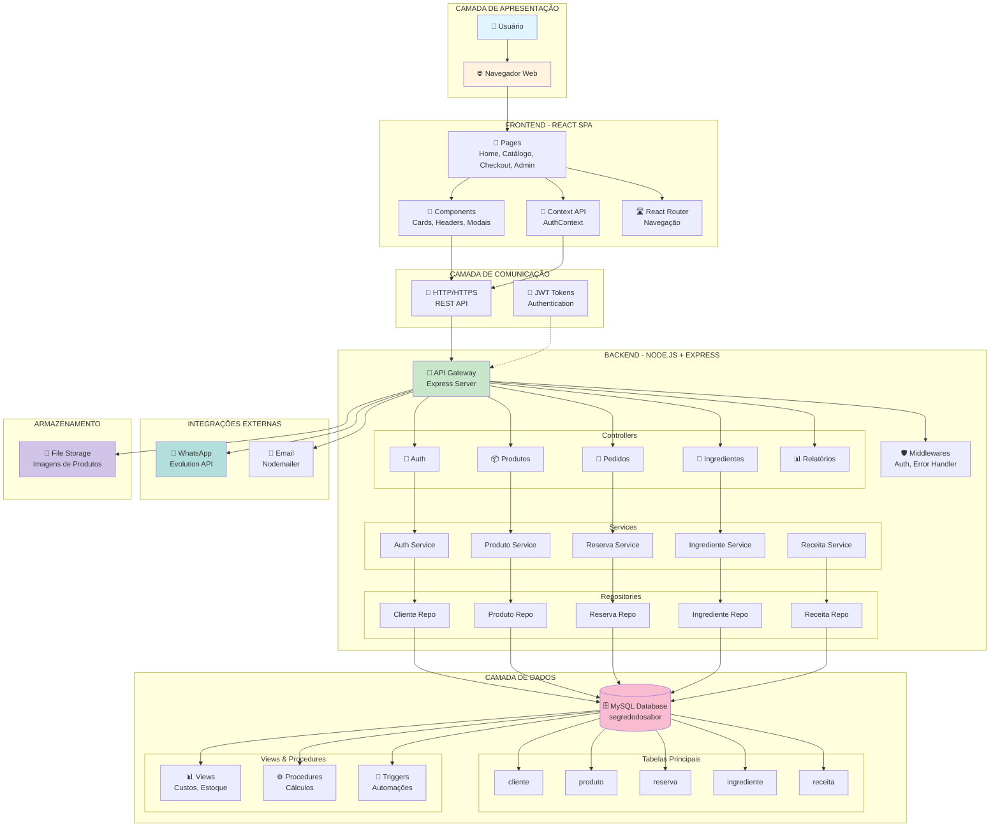

---

## 📊 Arquitetura Detalhada por Camadas

### 🎨 CAMADA 1: FRONTEND (React SPA)

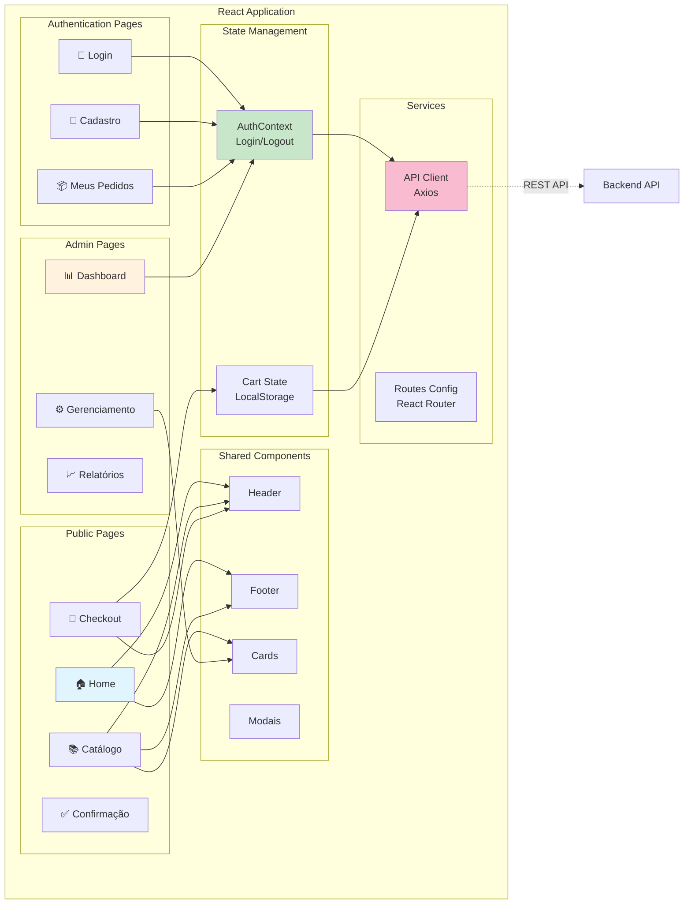

#### Descrição dos Componentes Frontend

##### **Pages (Páginas)**

1. **Home** (`/`)
   - Landing page do site
   - Carrossel de produtos
   - Destaques e promoções
   - Navegação para catálogo

2. **Catálogo** (`/catalogo`)
   - Listagem de produtos disponíveis
   - Filtros por categoria
   - Busca de produtos
   - Adicionar ao carrinho

3. **Checkout** (`/checkout`)
   - Revisão do pedido
   - Seleção de entrega/retirada
   - Forma de pagamento
   - Finalização do pedido

4. **Meus Pedidos** (`/meus-pedidos`)
   - Histórico de pedidos
   - Rastreamento de status
   - Detalhes de cada pedido

5. **Dashboard Admin** (`/gerenciamentos`)
   - Visão geral do negócio
   - Pedidos pendentes
   - Estatísticas de vendas
   - Gestão de produtos, ingredientes e receitas

##### **Components (Componentes Reutilizáveis)**

- **Header/Footer**: Navegação e informações
- **Cards**: Exibição de produtos e pedidos
- **Carrinho**: Modal do carrinho de compras
- **Modais**: Diálogos para ações diversas

##### **Context API**

- **AuthContext**: Gerencia autenticação
  - Login/Logout
  - Dados do usuário
  - Token JWT
  - Verificação de admin

##### **State Management**

- **LocalStorage**: Carrinho de compras (persistência)
- **React Hooks**: useState, useEffect, useContext
- **Session Storage**: Dados temporários

---

### ⚙️ CAMADA 2: BACKEND (Node.js + Express)

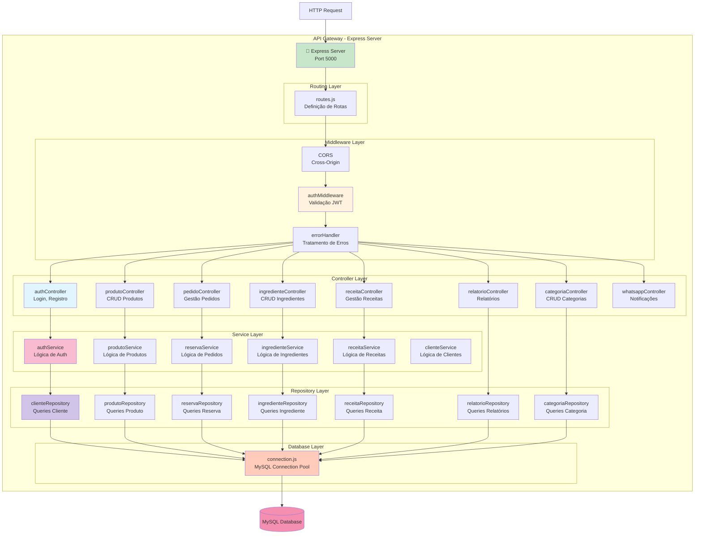

#### Descrição dos Componentes Backend

##### **Routing Layer (Camada de Rotas)**

- **routes.js**: Define todas as rotas da API
  - `POST /api/auth/login` - Login
  - `POST /api/auth/register` - Cadastro
  - `GET /api/produtos` - Listar produtos
  - `POST /api/reservas` - Criar pedido
  - `GET /api/relatorios/vendas` - Relatórios
  - E muitas outras...

##### **Middleware Layer (Camada de Middlewares)**

1. **authMiddleware**
   - Valida token JWT
   - Verifica autenticação
   - Extrai dados do usuário
   - Protege rotas privadas

2. **errorHandler**
   - Captura erros
   - Formata respostas de erro
   - Log de erros
   - Status HTTP adequados

3. **CORS**
   - Permite requisições do frontend
   - Configuração de origens permitidas

##### **Controller Layer (Camada de Controle)**

Responsável por receber requisições HTTP e chamar os services apropriados.

- **authController**: Login, registro, recuperação de senha
- **produtoController**: CRUD de produtos
- **pedidoController**: Gestão de pedidos
- **ingredienteController**: CRUD de ingredientes
- **receitaController**: Gestão de receitas
- **relatorioController**: Geração de relatórios
- **categoriaController**: CRUD de categorias
- **whatsappController**: Envio de notificações

##### **Service Layer (Camada de Negócio)**

Contém a lógica de negócio da aplicação.

- **authService**: Hash de senhas, geração de tokens
- **produtoService**: Validações de produtos
- **reservaService**: Validações de pedidos, cálculos
- **ingredienteService**: Controle de estoque
- **receitaService**: Cálculo de custos

##### **Repository Layer (Camada de Dados)**

Responsável pelas queries SQL e interação com o banco.

- **clienteRepository**: Queries de clientes
- **produtoRepository**: Queries de produtos
- **reservaRepository**: Queries de pedidos
- **ingredienteRepository**: Queries de ingredientes
- **receitaRepository**: Queries de receitas

##### **Database Layer**

- **connection.js**: Pool de conexões MySQL
  - Configuração de conexão
  - Gerenciamento de pool
  - Tratamento de erros de conexão

---

### 🗄️ CAMADA 3: BANCO DE DADOS (MySQL)

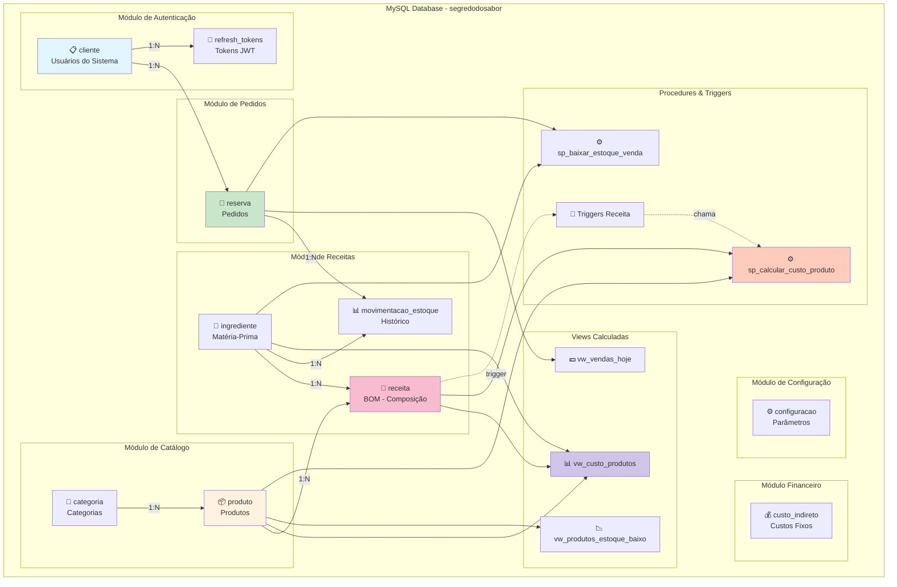

#### Descrição das Tabelas e Objetos

##### **Tabelas Principais**

1. **cliente**: Usuários (clientes e administradores)
2. **refresh_tokens**: Tokens JWT para renovação
3. **categoria**: Categorias de produtos
4. **produto**: Produtos do catálogo
5. **reserva**: Pedidos dos clientes
6. **ingrediente**: Matérias-primas
7. **receita**: Composição dos produtos (BOM)
8. **movimentacao_estoque**: Histórico de movimentações
9. **custo_indireto**: Custos fixos mensais
10. **configuracao**: Configurações do sistema

##### **Views (Consultas Otimizadas)**

1. **vw_custo_produtos**: Análise de custos e margens
2. **vw_produtos_estoque_baixo**: Produtos com estoque crítico
3. **vw_ingredientes_estoque_baixo**: Ingredientes para comprar
4. **vw_vendas_hoje**: Dashboard de vendas do dia
5. **vw_vendas_mes_atual**: Vendas diárias do mês
6. **vw_produtos_mais_vendidos**: Ranking de produtos

##### **Procedures (Procedimentos Armazenados)**

1. **sp_calcular_custo_produto**: Calcula custo baseado na receita
2. **sp_recalcular_todos_custos**: Recalcula todos os custos
3. **sp_baixar_estoque_venda**: Baixa estoque após venda
4. **sp_adicionar_receita**: Adiciona ingrediente à receita
5. **sp_gerar_codigo_pedido**: Gera código único de pedido

##### **Triggers (Gatilhos Automáticos)**

1. **tr_receita_after_insert**: Recalcula custo ao adicionar ingrediente
2. **tr_receita_after_update**: Recalcula custo ao alterar quantidade
3. **tr_receita_after_delete**: Recalcula custo ao remover ingrediente
4. **tr_ingrediente_after_update**: Atualiza custos ao mudar preço
5. **tr_reserva_before_insert**: Gera código do pedido automaticamente

---

## 🔄 Fluxo de Dados Completo

### Fluxo 1: Autenticação de Usuário

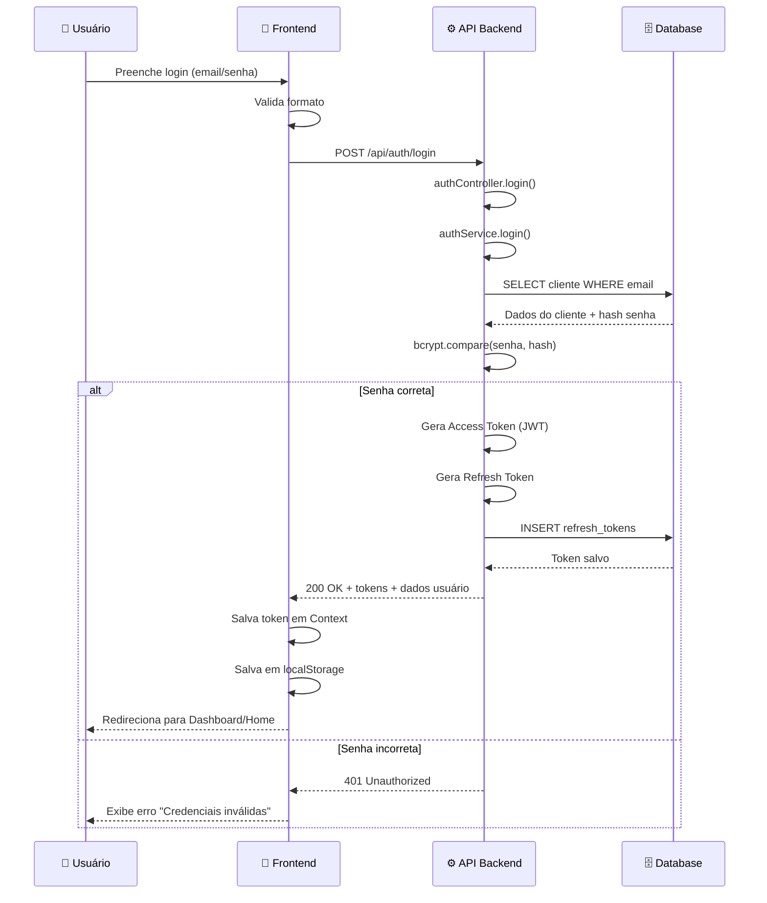

### Fluxo 2: Criação de Pedido (Checkout)

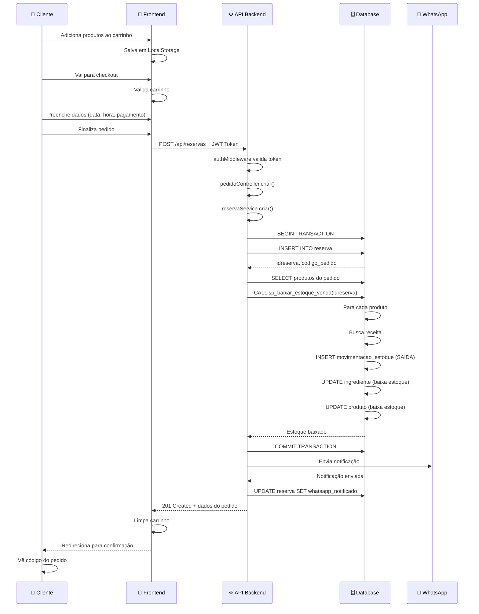

### Fluxo 3: Cálculo de Custos Automático

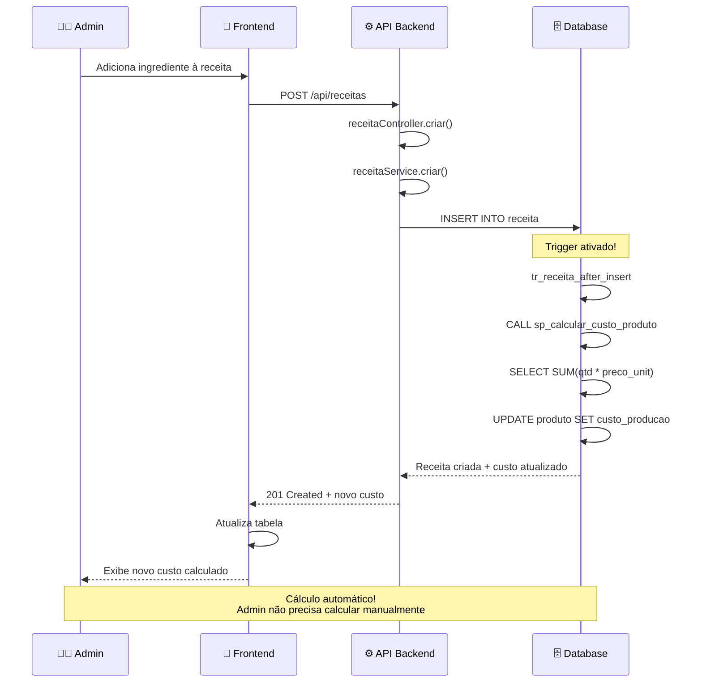

### Fluxo 4: Consulta de Produtos (Catálogo)

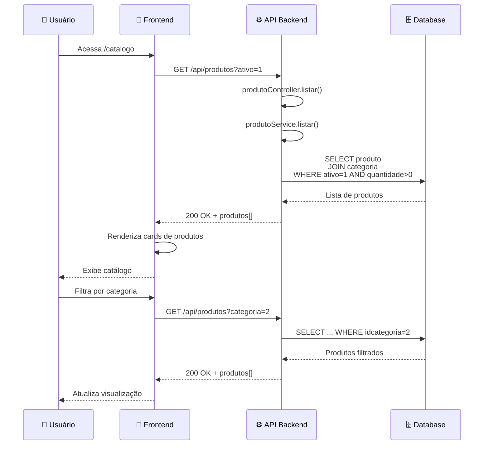

---

## 🔐 Segurança da Aplicação

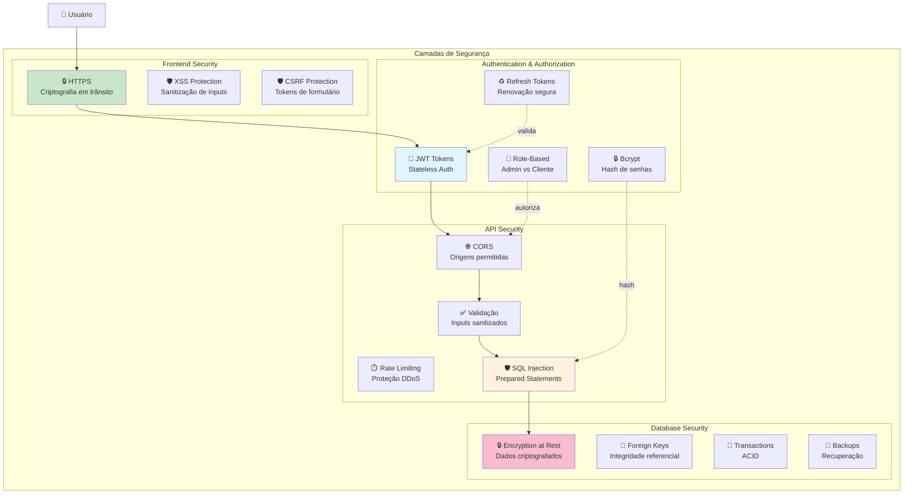

### Implementações de Segurança

#### **Frontend**
- **HTTPS**: Conexão criptografada
- **XSS Protection**: Sanitização de inputs
- **CSRF**: Tokens em formulários
- **Content Security Policy**: Restrição de scripts

#### **Autenticação**
- **JWT**: Tokens assinados com secret
- **Bcrypt**: Hash de senhas (cost 10)
- **Refresh Tokens**: Armazenados no banco, revogáveis
- **Expiração**: Access token 1h, Refresh token 7 dias

#### **API**
- **CORS**: Apenas origens permitidas
- **Rate Limiting**: Proteção contra DDoS
- **Validação**: Todos os inputs validados
- **Prepared Statements**: Proteção SQL Injection

#### **Banco de Dados**
- **Encryption**: Dados sensíveis criptografados
- **Foreign Keys**: Integridade referencial
- **Transactions**: Operações ACID
- **Backups**: Automáticos e regulares

---

## 🔌 Integrações Externas

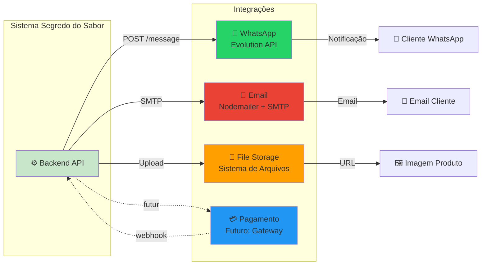

### Descrição das Integrações

#### **1. WhatsApp (Evolution API)**

**Função**: Envio de notificações automáticas para clientes

**Fluxo**:
1. Cliente finaliza pedido
2. Backend chama Evolution API
3. Mensagem enviada para WhatsApp do cliente
4. Cliente recebe notificação com código do pedido

**Mensagens Enviadas**:
- Confirmação de pedido
- Mudança de status
- Pedido pronto para retirada
- Pedido saiu para entrega

**Implementação**:
```javascript
// whatsappService.js
async function enviarNotificacao(telefone, mensagem) {
  await axios.post(`${EVOLUTION_API_URL}/message/sendText`, {
    number: telefone,
    text: mensagem
  });
}
```

#### **2. Email (Nodemailer)**

**Função**: Envio de emails transacionais

**Casos de Uso**:
- Recuperação de senha
- Confirmação de cadastro
- Relatórios periódicos
- Notificações importantes

**Implementação**:
```javascript
// emailService.js
const transporter = nodemailer.createTransport({
  service: 'gmail',
  auth: { user: EMAIL, pass: PASSWORD }
});
```

#### **3. File Storage (Sistema de Arquivos)**

**Função**: Armazenamento de imagens de produtos

**Estrutura**:
```
backend/
  storage/
    {hash_unico}.jpg
    {hash_unico}.png
```

**Fluxo**:
1. Admin faz upload de imagem
2. Backend salva com nome único (hash)
3. Caminho salvo no banco de dados
4. Frontend acessa via URL

**Exemplo**:
```javascript
// Multer configuration
const storage = multer.diskStorage({
  destination: './storage/',
  filename: (req, file, cb) => {
    const hash = crypto.randomBytes(16).toString('hex');
    cb(null, hash + path.extname(file.originalname));
  }
});
```

#### **4. Gateway de Pagamento (Futuro)**

**Planejado**: Integração com Mercado Pago, PagSeguro ou similar

**Funcionalidades Futuras**:
- Pagamento online (PIX, Cartão)
- Webhooks de confirmação
- Geração de QR Code PIX
- Controle de estornos

---

## ☁️ Infraestrutura e Deploy

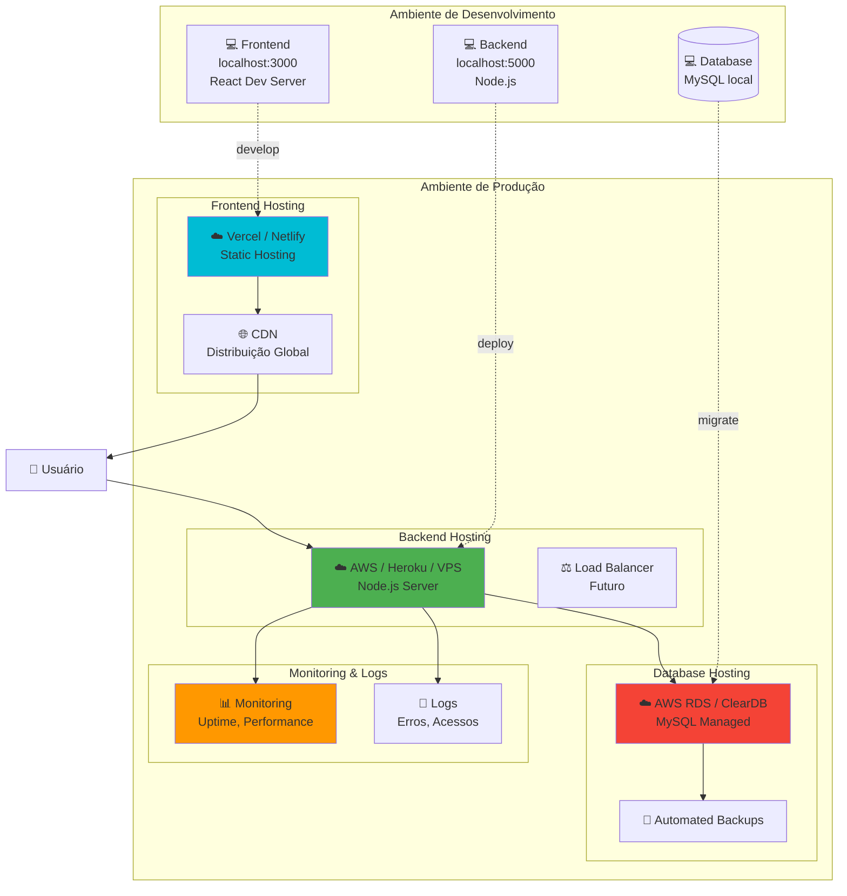

### Configurações de Deploy

#### **Frontend (React)**

**Opções de Hospedagem**:
- **Vercel** (Recomendado)
- **Netlify**
- **AWS S3 + CloudFront**
- **GitHub Pages**

**Build**:
```bash
npm run build
# Gera pasta /build com arquivos estáticos
```

**Variáveis de Ambiente**:
```
REACT_APP_API_URL=https://api.segredodosabor.com
REACT_APP_WHATSAPP=5511999999999
```

#### **Backend (Node.js)**

**Opções de Hospedagem**:
- **AWS EC2** (Controle total)
- **Heroku** (Simples)
- **DigitalOcean** (VPS)
- **Railway** (Moderno)

**Configuração**:
```bash
# .env production
PORT=5000
DB_HOST=prod-database.region.rds.amazonaws.com
DB_DATABASE=segredodosabor
DB_USER=admin
DB_PASSWORD=***
JWT_SECRET=***
NODE_ENV=production
```

**PM2 (Process Manager)**:
```bash
pm2 start src/server.js --name "segredo-do-sabor-api"
pm2 startup
pm2 save
```

#### **Banco de Dados (MySQL)**

**Opções de Hospedagem**:
- **AWS RDS** (Recomendado para produção)
- **ClearDB** (Heroku)
- **PlanetScale** (Serverless MySQL)
- **VPS próprio**

**Configuração**:
- Backup automático diário
- Replicação (futuro)
- Monitoramento de performance
- Firewall: apenas IPs permitidos

---

## 📈 Escalabilidade

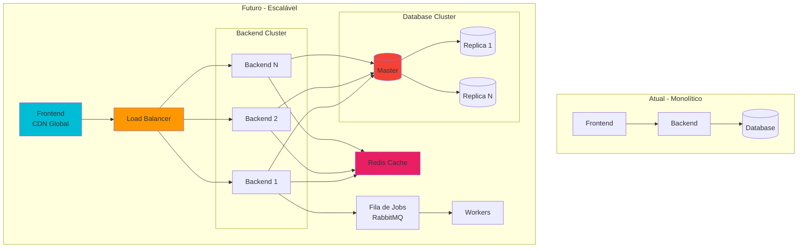

### Estratégias de Escalabilidade

#### **Escalabilidade Horizontal (Recomendado)**

**Frontend**:
- CDN para distribuição global
- Cache de assets (imagens, CSS, JS)
- Service Workers (PWA)

**Backend**:
- Múltiplas instâncias atrás de Load Balancer
- Stateless (JWT em vez de sessions)
- Cache de consultas frequentes (Redis)

**Database**:
- Master-Slave replication
- Read replicas para consultas
- Particionamento de tabelas grandes
- Índices otimizados

#### **Otimizações Atuais**

1. **Connection Pooling**: Reutilização de conexões MySQL
2. **Índices**: Otimização de queries
3. **Views**: Queries complexas pré-calculadas
4. **Procedures**: Lógica no banco para reduzir round-trips
5. **Caching Frontend**: LocalStorage para carrinho

#### **Próximos Passos**

1. **Redis**: Cache de sessões e dados frequentes
2. **Queue**: Processamento assíncrono (emails, relatórios)
3. **Microserviços**: Separar módulos críticos
4. **Monitoring**: Ferramentas de APM (New Relic, DataDog)
5. **Auto-scaling**: Aumentar recursos automaticamente

---

## 📊 Diagramas de Contexto

### Diagrama C4 - Nível 1: Contexto do Sistema

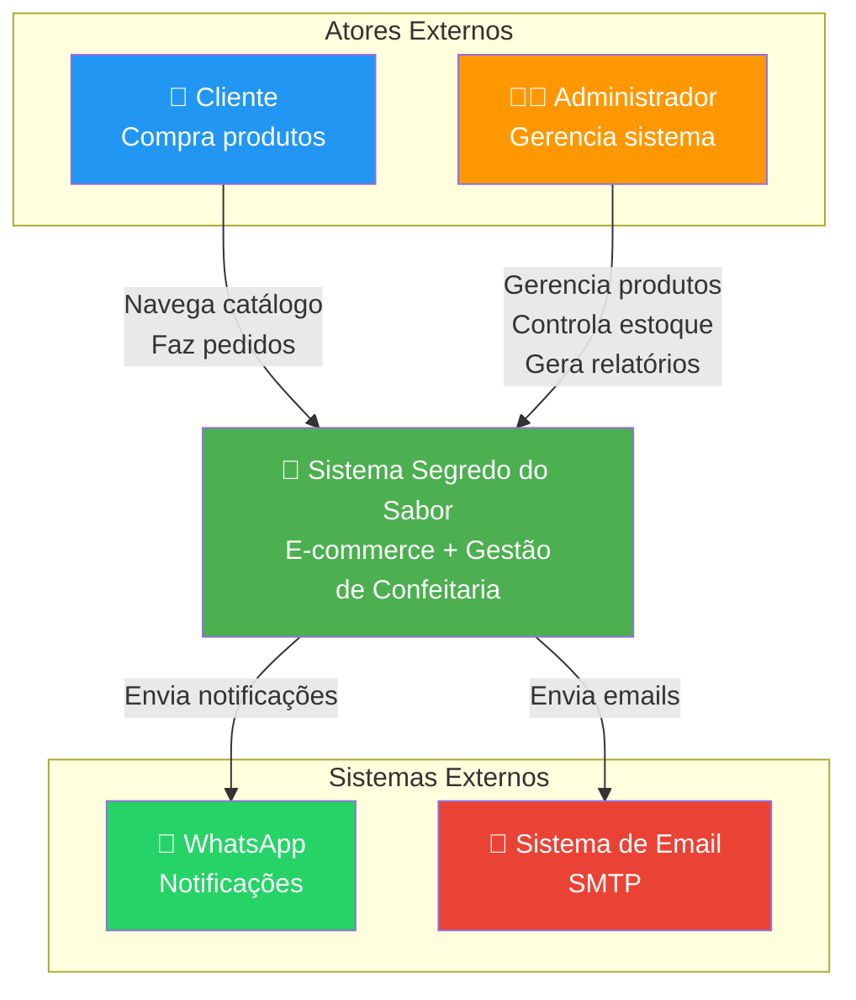

### Diagrama C4 - Nível 2: Containers

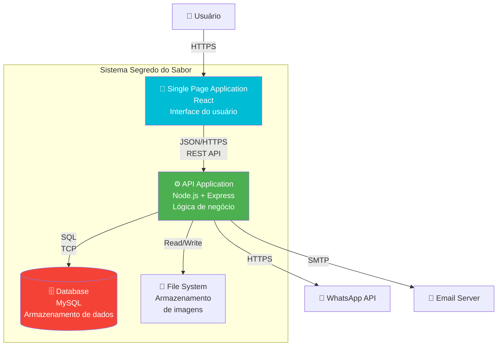

---

## 🎯 Principais Características da Arquitetura

### ✅ Pontos Fortes

1. **Separação de Responsabilidades**
   - Frontend focado em UI/UX
   - Backend focado em lógica de negócio
   - Database focado em persistência

2. **Arquitetura em Camadas**
   - Controllers: Recebem requisições
   - Services: Lógica de negócio
   - Repositories: Acesso a dados
   - Fácil manutenção e teste

3. **Stateless Authentication**
   - JWT permite escalabilidade horizontal
   - Não depende de sessões no servidor
   - Refresh tokens para segurança

4. **Automações no Banco**
   - Triggers para cálculos automáticos
   - Procedures para operações complexas
   - Views para consultas otimizadas

5. **Modularidade**
   - Componentes React reutilizáveis
   - Módulos Node.js bem definidos
   - Fácil adicionar novos recursos

### ⚠️ Considerações e Limitações

1. **Monolítico Atual**
   - Backend único pode ser gargalo
   - Solução: Migrar para microserviços no futuro

2. **File Storage Local**
   - Imagens salvas em filesystem
   - Solução: Migrar para S3/CloudStorage

3. **Sem Cache**
   - Todas as queries vão ao banco
   - Solução: Implementar Redis

4. **Sem Fila de Jobs**
   - Processos síncronos podem travar
   - Solução: Implementar RabbitMQ/Bull

5. **Monitoramento Básico**
   - Logs apenas em console
   - Solução: Implementar APM (New Relic, Sentry)

---

## 📚 Tecnologias e Versões Detalhadas

### Frontend

| Tecnologia | Versão | Propósito |
|-----------|--------|-----------|
| React | 18.2.0 | Framework UI |
| React Router | 6.x | Navegação SPA |
| Axios | 1.x | Cliente HTTP |
| SCSS | - | Estilização |
| Context API | React 18 | State Management |
| LocalStorage | Browser API | Persistência local |

### Backend

| Tecnologia | Versão | Propósito |
|-----------|--------|-----------|
| Node.js | 20.x LTS | Runtime JavaScript |
| Express | 4.18.x | Framework web |
| MySQL2 | 3.x | Driver MySQL |
| bcrypt | 5.x | Hash de senhas |
| jsonwebtoken | 9.x | Geração de JWT |
| multer | 1.x | Upload de arquivos |
| cors | 2.x | Cross-Origin |
| dotenv | 16.x | Variáveis de ambiente |

### Banco de Dados

| Tecnologia | Versão | Propósito |
|-----------|--------|-----------|
| MySQL | 8.0+ | Banco relacional |
| InnoDB | Default | Engine transacional |
| UTF8MB4 | Charset | Suporte completo Unicode |

### Ferramentas de Desenvolvimento

| Ferramenta | Propósito |
|-----------|-----------|
| Git | Controle de versão |
| npm | Gerenciador de pacotes |
| MySQL Workbench | Administração BD |
| Postman | Teste de APIs |
| VS Code | Editor de código |

---

## 🔍 Conclusão

A arquitetura do **Segredo do Sabor** foi projetada para ser:

- **Escalável**: Pronta para crescer conforme a demanda
- **Manutenível**: Código organizado e documentado
- **Segura**: Múltiplas camadas de segurança
- **Performática**: Otimizações em todos os níveis
- **Moderna**: Tecnologias atuais e boas práticas

O sistema utiliza uma arquitetura cliente-servidor clássica, mas moderna, com separação clara de responsabilidades e preparada para evoluções futuras como microserviços, cache distribuído e processamento assíncrono.

---

**Documentação Completa**: 13 de Outubro de 2025  
**Versão do Sistema**: 4.0 - DoceGest MVP  
**Arquiteto**: Sistema Segredo do Sabor

