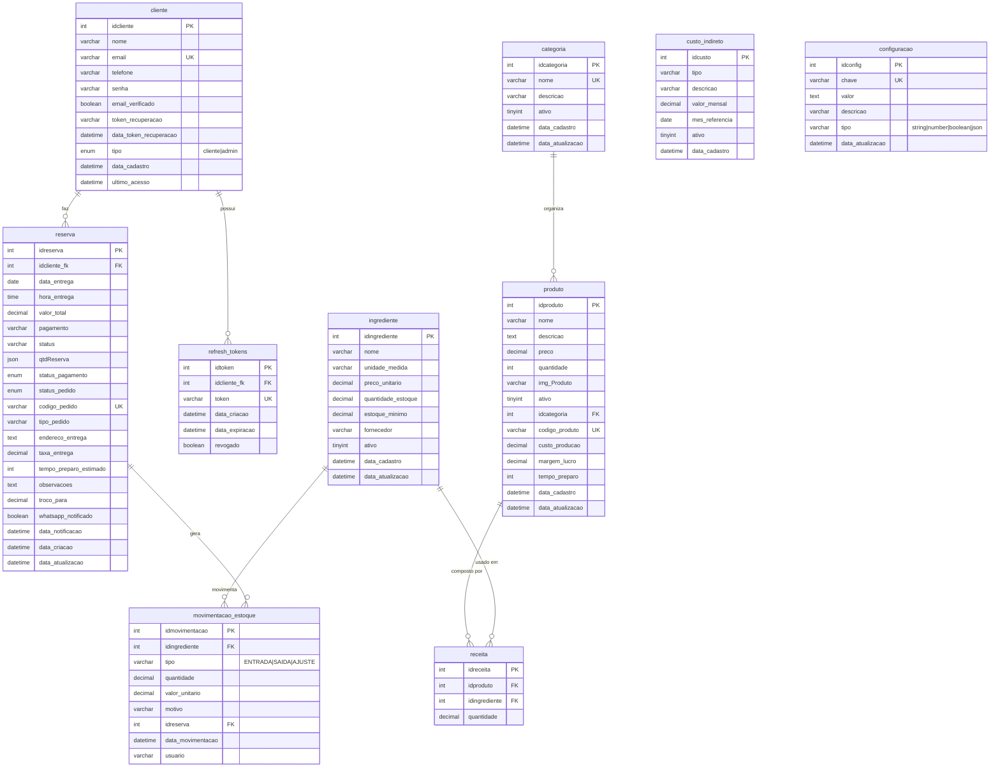
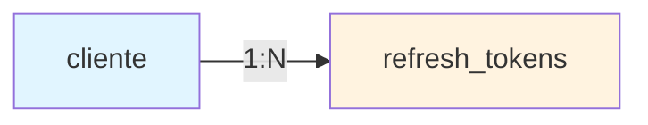
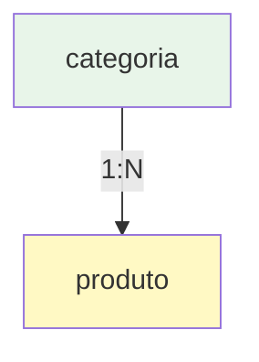
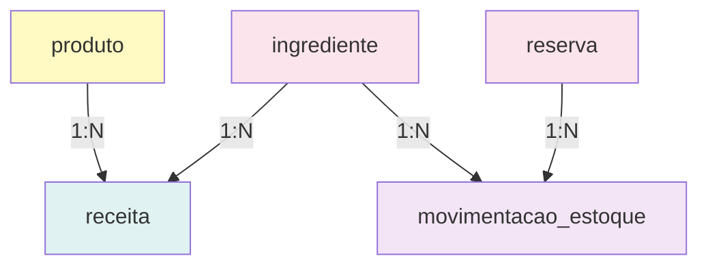
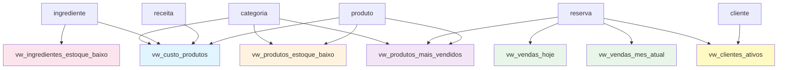
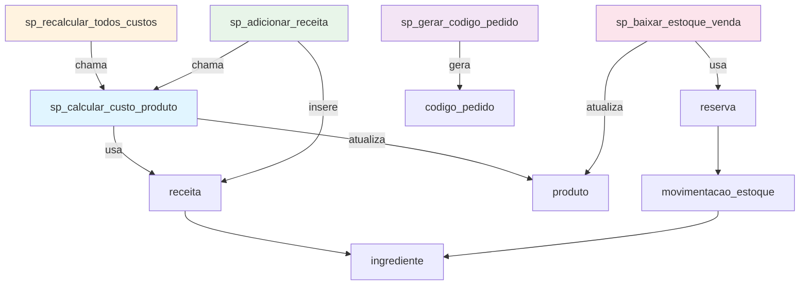

# 📊 Diagrama Entidade-Relacionamento (ER)
## Sistema Segredo do Sabor - Banco de Dados

---

## Diagrama ER Completo (Mermaid)



---

## Diagrama Simplificado por Módulos

### 🔐 Módulo de Autenticação



### 🛍️ Módulo de Catálogo



### 🛒 Módulo de Pedidos


### 🧪 Módulo de Receitas e Estoque



### 💰 Módulo Financeiro

```mermaid
graph LR
    A[custo_indireto] -->|contribui| B[Análise de Custos]
    C[produto] -->|custo_producao| B
    D[receita] -->|ingredientes| C
    
    style A fill:#fff3e0
    style B fill:#f3e5f5
    style C fill:#fff9c4
    style D fill:#e0f2f1
```



---

## Fluxo de Dados: Criação de Pedido

```mermaid
sequenceDiagram
    participant C as Cliente
    participant P as Produto
    participant R as Reserva
    participant I as Ingrediente
    participant M as Movimentação

    C->>P: Seleciona produtos
    P-->>C: Valida estoque
    C->>R: Cria pedido (JSON)
    R->>R: Gera código_pedido
    R->>M: Registra saída
    M->>I: Baixa estoque
    I-->>M: Confirma
    M-->>R: Confirma
    R-->>C: Pedido confirmado
```



---

## Fluxo de Cálculo de Custos

```mermaid
flowchart TD
    A[Produto] --> B{Tem receita?}
    B -->|Sim| C[Busca ingredientes]
    B -->|Não| D[Custo = 0]
    C --> E[Soma quantidade × preço]
    E --> F[Atualiza custo_producao]
    F --> G[Calcula margem de lucro]
    G --> H[% = lucro / preço × 100]
```



---

## Relacionamentos Detalhados

### Legenda
- **1:1** = Um para Um
- **1:N** = Um para Muitos
- **N:M** = Muitos para Muitos (através de tabela intermediária)
- **PK** = Primary Key
- **FK** = Foreign Key
- **UK** = Unique Key

### Tabela de Relacionamentos

| Tabela Pai | Relação | Tabela Filha | Cardinalidade | On Delete |
|------------|---------|--------------|---------------|-----------|
| cliente | faz | reserva | 1:N | NO ACTION |
| cliente | possui | refresh_tokens | 1:N | CASCADE |
| categoria | organiza | produto | 1:N | NO ACTION |
| produto | composto por | receita | 1:N | CASCADE |
| ingrediente | usado em | receita | 1:N | RESTRICT |
| ingrediente | movimenta | movimentacao_estoque | 1:N | NO ACTION |
| reserva | gera | movimentacao_estoque | 1:N | NO ACTION |

---

## Índices por Tabela

### cliente
```
- PRIMARY KEY (idcliente)
- UNIQUE KEY (email)
- INDEX idx_cliente_email (email)
- INDEX idx_cliente_tipo (tipo)
```

### produto
```
- PRIMARY KEY (idproduto)
- UNIQUE KEY (codigo_produto)
- FOREIGN KEY (idcategoria) → categoria(idcategoria)
- INDEX idx_produto_categoria (idcategoria)
- INDEX idx_produto_ativo (ativo)
- INDEX idx_produto_codigo (codigo_produto)
```

### reserva
```
- PRIMARY KEY (idreserva)
- UNIQUE KEY (codigo_pedido)
- FOREIGN KEY (idcliente_fk) → cliente(idcliente)
- INDEX idx_reserva_status (status)
- INDEX idx_reserva_data (data_entrega)
- INDEX idx_reserva_cliente (idcliente_fk)
- INDEX idx_reserva_codigo (codigo_pedido)
```

### receita
```
- PRIMARY KEY (idreceita)
- UNIQUE KEY (idproduto, idingrediente)
- FOREIGN KEY (idproduto) → produto(idproduto) CASCADE
- FOREIGN KEY (idingrediente) → ingrediente(idingrediente) RESTRICT
- INDEX idx_receita_produto (idproduto)
- INDEX idx_receita_ingrediente (idingrediente)
```

---

## Views e suas Dependências



---

## Triggers e suas Ações

```mermaid
flowchart LR
    A[INSERT/UPDATE/DELETE receita] -->|trigger| B[sp_calcular_custo_produto]
    B --> C[Atualiza custo_producao]
    
    D[UPDATE ingrediente preço] -->|trigger| E[Recalcula custos]
    E --> F[Atualiza produtos afetados]
    
    G[INSERT reserva] -->|trigger| H[Gera codigo_pedido]
    H --> I[PED + data + sequencial]
    
    style A fill:#e1f5ff
    style D fill:#fce4ec
    style G fill:#fff3e0
```



---

## Stored Procedures



---

## Tamanhos de Campos Importantes

### Campos VARCHAR

| Campo | Tamanho | Razão |
|-------|---------|-------|
| email | 100 | Emails padrão até 100 chars |
| telefone | 20 | +55 (11) 99999-9999 |
| senha | 255 | Hash bcrypt completo |
| token (refresh) | 500 | JWT pode ser longo |
| codigo_pedido | 20 | PED20251013001 = 14 chars |
| nome (cliente) | 100 | Nomes completos |
| nome (produto) | 100 | Nomes descritivos |
| nome (ingrediente) | 100 | Nomes detalhados |

### Campos DECIMAL

| Campo | Formato | Máximo |
|-------|---------|--------|
| preco | (10,2) | R$ 99.999.999,99 |
| valor_total | (10,2) | R$ 99.999.999,99 |
| custo_producao | (10,2) | R$ 99.999.999,99 |
| margem_lucro | (5,2) | 999,99% |
| quantidade_estoque | (10,3) | 9.999.999,999 |
| preco_unitario | (10,2) | R$ 99.999.999,99 |

---

## Enumerações (ENUM)

### cliente.tipo
```
'cliente' | 'admin'
```

### reserva.status_pagamento
```
'pendente' | 'confirmado' | 'cancelado'
```

### reserva.status_pedido
```
'pendente' | 'confirmado' | 'preparando' | 'pronto' | 'entregue' | 'cancelado'
```

### movimentacao_estoque.tipo
```
'ENTRADA' | 'SAIDA' | 'AJUSTE'
```

### configuracao.tipo
```
'string' | 'number' | 'boolean' | 'json'
```

---

## Formato JSON (reserva.qtdReserva)

```json
[
  {
    "id": 1,
    "nome": "Cone Ovomaltine",
    "quantidade": 2,
    "preco": 12.50
  },
  {
    "id": 3,
    "nome": "Cone Kinder Bueno",
    "quantidade": 1,
    "preco": 15.00
  }
]
```

### Estrutura
```typescript
interface ItemReserva {
  id: number;          // idproduto
  nome: string;        // nome do produto
  quantidade: number;  // quantidade comprada
  preco: number;       // preço unitário
}

type QtdReserva = ItemReserva[];
```

---

## Dependências de Dados

### Para criar um PEDIDO precisa:
1. ✅ Cliente cadastrado
2. ✅ Produtos ativos com estoque
3. ✅ Ingredientes com estoque (para baixa)

### Para criar um PRODUTO precisa:
1. ✅ Categoria existente
2. ⚠️ Receita (opcional, mas recomendado)
3. ⚠️ Imagem (opcional)

### Para criar uma RECEITA precisa:
1. ✅ Produto existente
2. ✅ Ingredientes cadastrados

### Para baixar ESTOQUE precisa:
1. ✅ Reserva existente
2. ✅ Produtos com receita cadastrada
3. ✅ Ingredientes com estoque suficiente

---

## Constraints e Validações

### NOT NULL (obrigatórios)
```sql
-- cliente
nome, email, telefone

-- produto
nome, preco

-- reserva
idcliente_fk, data_entrega, hora_entrega, valor_total, pagamento, qtdReserva

-- ingrediente
nome, unidade_medida, preco_unitario, quantidade_estoque

-- receita
idproduto, idingrediente, quantidade
```

### UNIQUE (únicos)
```sql
-- cliente
email

-- produto
codigo_produto

-- reserva
codigo_pedido

-- categoria
nome

-- refresh_tokens
token

-- configuracao
chave
```

### DEFAULT (valores padrão)
```sql
-- Booleans
ativo = 1
email_verificado = FALSE
revogado = FALSE
whatsapp_notificado = FALSE

-- Números
margem_lucro = 40
tempo_preparo = 30
taxa_entrega = 0
quantidade = 0
quantidade_estoque = 0

-- Enums
tipo = 'cliente'
status = 'Pendente'
status_pagamento = 'pendente'
status_pedido = 'pendente'
tipo_pedido = 'RETIRADA'

-- Datas
data_cadastro = CURRENT_TIMESTAMP
data_criacao = CURRENT_TIMESTAMP
```

---

## Backup e Restore

### Script de Backup Completo
```bash
#!/bin/bash
# backup_completo.sh

DATA=$(date +%Y%m%d_%H%M%S)
ARQUIVO="backup_segredodosabor_$DATA.sql"

mysqldump -u root -p \
  --single-transaction \
  --routines \
  --triggers \
  --events \
  segredodosabor > $ARQUIVO

gzip $ARQUIVO
echo "Backup criado: ${ARQUIVO}.gz"
```

### Script de Restore
```bash
#!/bin/bash
# restore.sh

if [ -z "$1" ]; then
  echo "Uso: ./restore.sh arquivo.sql.gz"
  exit 1
fi

gunzip -c $1 | mysql -u root -p segredodosabor
echo "Restore concluído!"
```

---

## Monitoramento de Saúde

### Queries de Diagnóstico

```sql
-- Tamanho das tabelas
SELECT 
    TABLE_NAME,
    ROUND(((DATA_LENGTH + INDEX_LENGTH) / 1024 / 1024), 2) AS 'Tamanho (MB)',
    TABLE_ROWS AS 'Linhas'
FROM information_schema.TABLES
WHERE TABLE_SCHEMA = 'segredodosabor'
ORDER BY (DATA_LENGTH + INDEX_LENGTH) DESC;

-- Índices não utilizados
SELECT * FROM sys.schema_unused_indexes
WHERE object_schema = 'segredodosabor';

-- Tabelas sem PK
SELECT TABLE_NAME
FROM information_schema.TABLES
WHERE TABLE_SCHEMA = 'segredodosabor'
  AND TABLE_TYPE = 'BASE TABLE'
  AND TABLE_NAME NOT IN (
    SELECT TABLE_NAME
    FROM information_schema.TABLE_CONSTRAINTS
    WHERE CONSTRAINT_TYPE = 'PRIMARY KEY'
      AND TABLE_SCHEMA = 'segredodosabor'
  );

-- Fragmentação de tabelas
SELECT 
    TABLE_NAME,
    ROUND(DATA_FREE / 1024 / 1024, 2) AS 'Fragmentação (MB)'
FROM information_schema.TABLES
WHERE TABLE_SCHEMA = 'segredodosabor'
  AND DATA_FREE > 0
ORDER BY DATA_FREE DESC;
```

---

## Performance Benchmarks

### Consultas Esperadas

| Query | Tempo Esperado | Observação |
|-------|----------------|------------|
| SELECT produto by ID | < 5ms | Com cache |
| SELECT catálogo (50 itens) | < 50ms | Com índices |
| INSERT reserva | < 100ms | Com triggers |
| UPDATE estoque | < 50ms | Transacional |
| SELECT dashboard | < 200ms | Views complexas |
| CALL sp_calcular_custo | < 30ms | Por produto |
| SELECT relatório mensal | < 500ms | Agregações |

### Otimizações Aplicadas

- ✅ Índices em colunas de busca
- ✅ Views materializadas (cached no app)
- ✅ Prepared statements
- ✅ Connection pooling
- ✅ Query cache habilitado
- ✅ InnoDB buffer pool otimizado

---

**Última atualização**: 13 de Outubro de 2025  
**Versão**: 4.0 - DoceGest MVP
