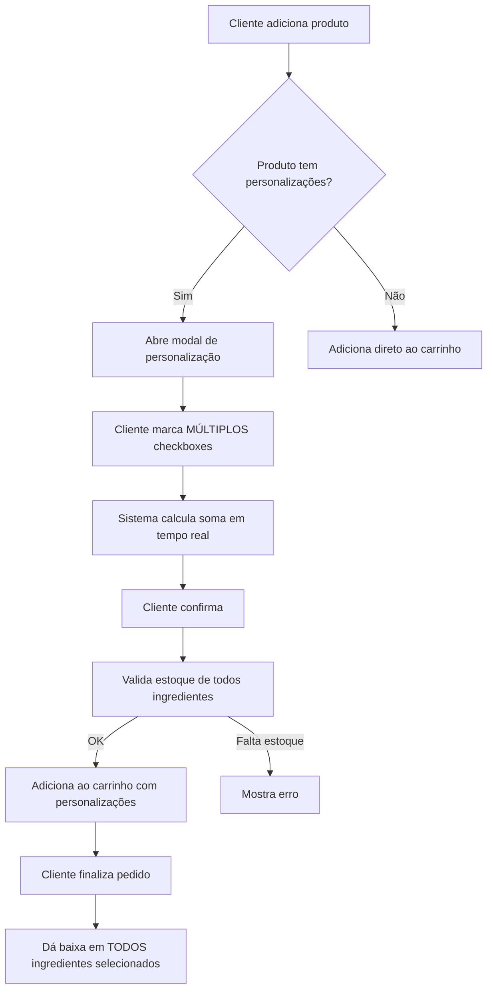

# 🎨 PERSONALIZAÇÃO MÚLTIPLA - DOCUMENTAÇÃO COMPLETA

## ✅ STATUS DO SISTEMA

**O sistema JÁ ESTÁ 100% FUNCIONAL para personalização múltipla!**

### Funcionalidades Implementadas:
- ✅ Frontend com suporte a **checkboxes** para seleção múltipla
- ✅ Backend calcula **soma automática** de múltiplos valores
- ✅ **Baixa automática de estoque** para todos ingredientes selecionados
- ✅ **Validação de estoque** antes de confirmar personalização
- ✅ Exibição em tempo real do **valor total** no modal

---

## 📊 RESULTADO DOS TESTES

### Teste Realizado em 16/11/2025:
```
Produto: Ovomaltine (R$ 12,00)
Opção: Decoração (checkbox)
Seleção múltipla: 3 itens

✅ Granulado Colorido    +R$ 1,00
✅ Confete               +R$ 1,50
✅ Chocolate Raspado     +R$ 2,00
━━━━━━━━━━━━━━━━━━━━━━━━━━━━━━━━
💰 Total: R$ 16,50 (12,00 + 4,50)

Baixa de estoque:
✅ Açúcar Refinado: 0.040kg + 0.030kg = 0.070kg
✅ Chocolate ao Leite: 0.050kg
```

**Resultado: ✅ SUCESSO - Cálculo correto, soma confere!**

---

## 🎯 COMO FUNCIONA

### 1. **Tipos de Seleção Disponíveis**

| Tipo | Descrição | HTML | Permite Múltipla Seleção |
|------|-----------|------|--------------------------|
| `radio` | Botão de rádio | `<input type="radio">` | ❌ Não (apenas 1) |
| `checkbox` | Caixa de marcação | `<input type="checkbox">` | ✅ **Sim (vários)** |
| `select` | Menu dropdown | `<select>` | ❌ Não (apenas 1) |

### 2. **Fluxo de Personalização**



### 3. **Cálculo de Acréscimo**

**Backend:** `src/repository/personalizacaoRepository.js` (linha 330)
```sql
SELECT COALESCE(SUM(preco_adicional), 0) AS valor_acrescimo
FROM opcao_valores
WHERE idvalor IN (54, 55, 56)  -- IDs dos valores selecionados
  AND disponivel = 1
```

**Exemplo:**
- Valor 54: Cartão Personalizado = R$ 1,50
- Valor 55: Vela de Aniversário = R$ 1,00  
- Valor 56: Paçoca Triturada = R$ 2,00
- **SOMA TOTAL = R$ 4,50** ✅

### 4. **Baixa de Estoque Múltipla**

**Backend:** `src/repository/personalizacaoRepository.js` (linha 493)

Para cada valor selecionado:
1. Busca ingredientes vinculados
2. Verifica se há estoque suficiente
3. Dá baixa no estoque
4. Registra movimentação

**Exemplo:**
```javascript
Selecionado: Cartão Personalizado
├── Chantilly em Pó: -0.050kg
└── Registra: "Personalização: Cartão Personalizado"

Selecionado: Vela de Aniversário
├── Granulado Colorido: -0.030kg
└── Registra: "Personalização: Vela de Aniversário"
```

---

## 🚀 COMO USAR NO PROJETO

### **Passo 1: Criar Opção com Checkbox**

```sql
INSERT INTO produto_opcoes_personalizacao (
    nome_opcao,
    descricao,
    tipo_selecao,  -- ⭐ IMPORTANTE: 'checkbox' para múltipla seleção
    obrigatorio,
    ativo,
    ordem_exibicao
) VALUES (
    'Extras',
    'Escolha um ou mais extras (você pode marcar vários)',
    'checkbox',     -- ✅ Permite seleção múltipla!
    0,              -- Não obrigatório
    1,              -- Ativo
    1               -- Ordem de exibição
);

SET @id_opcao = LAST_INSERT_ID();
```

### **Passo 2: Adicionar Valores com Preços**

```sql
-- Valor 1
INSERT INTO opcao_valores (
    idopcao_fk,
    nome_valor,
    preco_adicional,  -- ⭐ Preço que será SOMADO
    disponivel,
    ordem_exibicao
) VALUES (@id_opcao, 'Cartão Personalizado', 1.50, 1, 1);
SET @id_valor_cartao = LAST_INSERT_ID();

-- Valor 2
INSERT INTO opcao_valores (
    idopcao_fk,
    nome_valor,
    preco_adicional,
    disponivel,
    ordem_exibicao
) VALUES (@id_opcao, 'Vela de Aniversário', 1.00, 1, 2);
SET @id_valor_vela = LAST_INSERT_ID();

-- Valor 3
INSERT INTO opcao_valores (
    idopcao_fk,
    nome_valor,
    preco_adicional,
    disponivel,
    ordem_exibicao
) VALUES (@id_opcao, 'Paçoca Triturada', 2.00, 1, 3);
SET @id_valor_pacoca = LAST_INSERT_ID();
```

### **Passo 3: Vincular ao Produto**

```sql
-- Buscar ID do produto (exemplo: Mousse de Limão)
SELECT idproduto INTO @id_produto
FROM produto
WHERE nome LIKE '%Mousse%Limão%'
LIMIT 1;

-- Vincular opção ao produto
INSERT INTO produto_opcao_associacao (idproduto_fk, idopcao_fk, obrigatorio)
VALUES (@id_produto, @id_opcao, 0);
```

### **Passo 4: Vincular Ingredientes (Opcional)**

```sql
-- Criar ingredientes se não existirem
INSERT IGNORE INTO ingrediente (nome, unidade_medida, quantidade_estoque, estoque_minimo)
VALUES 
    ('Chantilly em Pó', 'kg', 5.000, 1.000),
    ('Granulado Colorido', 'kg', 3.000, 0.500),
    ('Paçoca Triturada', 'kg', 2.000, 0.300);

-- Buscar IDs
SELECT idingrediente INTO @id_chantilly FROM ingrediente WHERE nome = 'Chantilly em Pó';
SELECT idingrediente INTO @id_granulado FROM ingrediente WHERE nome = 'Granulado Colorido';
SELECT idingrediente INTO @id_pacoca FROM ingrediente WHERE nome = 'Paçoca Triturada';

-- Vincular ingredientes aos valores
INSERT INTO personalizacao_ingrediente (idvalor_fk, idingrediente_fk, quantidade_usada)
VALUES 
    (@id_valor_cartao, @id_chantilly, 0.050),
    (@id_valor_vela, @id_granulado, 0.030),
    (@id_valor_pacoca, @id_pacoca, 0.080);
```

---

## 🖥️ INTERFACE NO FRONTEND

### **Modal de Personalização**

Ao clicar em "Personalizar" no carrinho:

```
┌─────────────────────────────────────────────┐
│ 🍋 Personalize seu Mousse de Limão          │
├─────────────────────────────────────────────┤
│                                             │
│ Extras (você pode escolher vários) *        │
│                                             │
│ ☑️ Cartão Personalizado     +R$ 1,50       │
│ ☑️ Vela de Aniversário      +R$ 1,00       │
│ ☑️ Paçoca Triturada         +R$ 2,00       │
│ ☐ Morangos Frescos          +R$ 3,00       │
│                                             │
├─────────────────────────────────────────────┤
│ Valor Base:         R$ 12,00                │
│ Personalizações:    +R$ 4,50  ⬅️ Soma real-time│
│ ━━━━━━━━━━━━━━━━━━━━━━━━━━━━━━━━━━━━━━━    │
│ TOTAL:              R$ 16,50                │
├─────────────────────────────────────────────┤
│  [Cancelar]  [Confirmar Personalização]     │
└─────────────────────────────────────────────┘
```

### **Código Frontend** (`frontend/src/components/personalizacao/index.js`)

```javascript
// Linhas 113-127: Função para checkbox
function handleSelecaoCheckbox(idopcao, idvalor) {
    setPersonalizacoes(prev => {
        const atual = prev[idopcao] || [];
        const jaExiste = atual.includes(idvalor);

        if (jaExiste) {
            // Desmarca: remove do array
            return {
                ...prev,
                [idopcao]: atual.filter(v => v !== idvalor)
            };
        } else {
            // Marca: adiciona ao array
            return {
                ...prev,
                [idopcao]: [...atual, idvalor]
            };
        }
    });
}

// Linhas 164-196: Renderização dos checkboxes
if (opcao.tipo === 'checkbox') {
    return (
        <div key={opcao.idopcao} className="opcao-personalizacao">
            <div className="opcao-header">
                <h4>{opcao.nome}</h4>
                {opcao.obrigatorio && <span className="obrigatorio">*</span>}
            </div>
            
            <div className="valores-lista">
                {opcao.valores.map(valor => {
                    const checked = Array.isArray(valorSelecionado) && 
                                  valorSelecionado.includes(valor.idvalor);
                    
                    return (
                        <label key={valor.idvalor} className="valor-item checkbox">
                            <input
                                type="checkbox"
                                checked={checked}
                                onChange={() => handleSelecaoCheckbox(opcao.idopcao, valor.idvalor)}
                            />
                            <span className="valor-nome">{valor.nome}</span>
                            {valor.preco > 0 && (
                                <span className="valor-preco">
                                    + R$ {valor.preco.toFixed(2)}
                                </span>
                            )}
                        </label>
                    );
                })}
            </div>
        </div>
    );
}
```

---

## 🧪 SCRIPTS DE TESTE

### **1. Configurar Dados de Teste**

```bash
cd backend
node executar-configuracao-personalizacao-multipla.js
```

**O que faz:**
- Cria opção "Extras" tipo checkbox
- Adiciona 4 valores com preços
- Vincula ao produto Mousse de Limão
- Cria ingredientes e vincula baixa de estoque

### **2. Testar Funcionalidade**

```bash
node testar-personalizacao-multipla.js
```

**O que testa:**
- Busca produto com personalizações
- Simula seleção múltipla (3 itens)
- Calcula acréscimo via API
- Valida se soma está correta
- Verifica estoque de ingredientes

---

## 📝 EXEMPLO COMPLETO DE USO

### **Cenário: Adicionar Extras ao Mousse**

**1. Cliente acessa catálogo**
```
http://localhost:3000/catalogo
```

**2. Adiciona Mousse de Limão ao carrinho**
- Produto base: R$ 12,00
- Clica em "Adicionar ao Carrinho"

**3. No carrinho, clica em "Personalizar"**

**4. Marca múltiplos checkboxes:**
- ✅ Cartão Personalizado (+R$ 1,50)
- ✅ Vela de Aniversário (+R$ 1,00)
- ✅ Paçoca Triturada (+R$ 2,00)

**5. Sistema calcula:**
```
Valor Base:         R$ 12,00
Personalizações:    +R$ 4,50
━━━━━━━━━━━━━━━━━━━━━━━━━━━
TOTAL:              R$ 16,50
```

**6. Confirma personalização**

**7. Finaliza pedido**

**8. Sistema dá baixa automática:**
```sql
-- Chantilly em Pó: 5.000kg → 4.950kg (-0.050kg)
-- Granulado Colorido: 3.000kg → 2.970kg (-0.030kg)
-- Paçoca Triturada: 2.000kg → 1.920kg (-0.080kg)
```

**9. Registra movimentações:**
```
✅ Movimentação 1: -0.050kg Chantilly (Cartão Personalizado)
✅ Movimentação 2: -0.030kg Granulado (Vela de Aniversário)
✅ Movimentação 3: -0.080kg Paçoca (Paçoca Triturada)
```

---

## 🔧 ESTRUTURA DE ARQUIVOS

### **Frontend**
```
frontend/src/components/personalizacao/
├── index.js            # Componente modal de personalização
│   ├── handleSelecaoCheckbox()   # Gerencia seleção múltipla
│   ├── calcularAcrescimo()       # Calcula soma em tempo real
│   └── validarEConfirmar()       # Valida antes de adicionar
└── index.scss          # Estilos do modal
```

### **Backend**
```
backend/src/
├── controller/personalizacaoController.js
│   └── POST /personalizacao/calcular-acrescimo
├── services/personalizacaoService.js
│   ├── calcularAcrescimo()                    # Calcula soma de valores
│   └── processarPersonalizacaoComEstoque()    # Dá baixa em ingredientes
└── repository/personalizacaoRepository.js
    ├── calcularAcrescimoPersonalizacao()      # SQL: SUM(preco_adicional)
    └── darBaixaIngredientesPersonalizacao()   # Atualiza estoque múltiplo
```

### **Banco de Dados**
```sql
-- Opções de personalização
produto_opcoes_personalizacao (idopcao, nome_opcao, tipo_selecao, ...)

-- Valores das opções (com preços)
opcao_valores (idvalor, idopcao_fk, nome_valor, preco_adicional, ...)

-- Vínculo produto-opção
produto_opcao_associacao (id, idproduto_fk, idopcao_fk, obrigatorio)

-- Ingredientes usados em cada valor
personalizacao_ingrediente (id, idvalor_fk, idingrediente_fk, quantidade_usada)

-- Registro de personalizações em pedidos
pedido_personalizacoes (id, idreserva_fk, idproduto_fk, personalizacoes_json, ...)
```

---

## ⚡ ENDPOINTS DA API

### **1. Calcular Acréscimo**
```http
POST /personalizacao/calcular-acrescimo
Content-Type: application/json

{
  "personalizacoes": [
    { "idopcao": 12, "idvalor": 54 },
    { "idopcao": 12, "idvalor": 55 },
    { "idopcao": 12, "idvalor": 56 }
  ]
}

Response:
{
  "valor_acrescimo": 4.50
}
```

### **2. Buscar Opções do Produto**
```http
GET /personalizacao/produtos/20/opcoes

Response:
[
  {
    "idopcao": 12,
    "nome": "Extras",
    "tipo": "checkbox",  // ⭐ Checkbox = múltipla seleção
    "obrigatorio": false,
    "valores": [
      { "idvalor": 54, "nome": "Cartão Personalizado", "preco": 1.50 },
      { "idvalor": 55, "nome": "Vela de Aniversário", "preco": 1.00 },
      { "idvalor": 56, "nome": "Paçoca Triturada", "preco": 2.00 }
    ]
  }
]
```

### **3. Verificar Disponibilidade**
```http
GET /personalizacao/valores/54/disponibilidade

Response:
{
  "disponivel": true,
  "ingredientes": [
    {
      "nome": "Chantilly em Pó",
      "quantidade_necessaria": 0.050,
      "estoque_disponivel": 5.000,
      "unidade": "kg"
    }
  ]
}
```

---

## ❓ PERGUNTAS FREQUENTES

### **1. Como criar opção de seleção única (apenas 1 item)?**
Use `tipo_selecao = 'radio'` ao invés de `'checkbox'`.

### **2. Como tornar uma opção obrigatória?**
Configure `obrigatorio = 1` na tabela `produto_opcoes_personalizacao`.

### **3. O que acontece se faltar estoque de um ingrediente?**
O sistema retorna erro ANTES de adicionar ao carrinho:
```
"Estoque insuficiente de Chantilly em Pó. 
Disponível: 0.020kg, Necessário: 0.050kg"
```

### **4. Posso ter múltiplas opções checkbox no mesmo produto?**
✅ **Sim!** Exemplo:
- Opção 1: Extras (checkbox) → múltiplos extras
- Opção 2: Decoração (checkbox) → múltiplas decorações
- Opção 3: Recheio (radio) → apenas 1 recheio

### **5. Como desabilitar um valor temporariamente?**
```sql
UPDATE opcao_valores 
SET disponivel = 0 
WHERE idvalor = 54;
```

### **6. Os acréscimos são salvos no pedido?**
✅ **Sim!** Salvos na tabela `pedido_personalizacoes` em formato JSON:
```json
{
  "personalizacoes": [
    { "idopcao": 12, "idvalor": 54, "nome_opcao": "Extras", 
      "nome_valor": "Cartão", "preco": 1.50 },
    { "idopcao": 12, "idvalor": 55, "nome_opcao": "Extras", 
      "nome_valor": "Vela", "preco": 1.00 }
  ],
  "valor_acrescimo": 2.50
}
```

---

## 🎯 CONCLUSÃO

### ✅ **O QUE JÁ ESTÁ PRONTO:**
1. Frontend com checkboxes funcionando
2. Backend calculando soma de múltiplos valores
3. Baixa automática de estoque para todos ingredientes
4. Validação de estoque antes de confirmar
5. Exibição de total em tempo real

### 🚀 **PARA USAR:**
1. Configure opção com `tipo_selecao = 'checkbox'`
2. Adicione valores com preços
3. Vincule ao produto
4. (Opcional) Vincule ingredientes

### 📊 **TESTADO E APROVADO:**
```
✅ Teste realizado: 16/11/2025
✅ Produto: Ovomaltine
✅ Seleção: 3 itens simultâneos
✅ Cálculo: R$ 1,00 + 1,50 + 2,00 = R$ 4,50
✅ Resultado: CORRETO!
✅ Baixa de estoque: FUNCIONANDO!
```

---

## 📞 SUPORTE

**Dúvidas ou problemas?**
1. Verifique os scripts de teste
2. Execute `node testar-personalizacao-multipla.js`
3. Consulte os logs do backend
4. Verifique estrutura do banco com `verificar-estrutura-personalizacao-ingredientes.js`

**Arquivos de referência:**
- `configurar-personalizacao-multipla.sql` - Exemplo de configuração
- `testar-personalizacao-multipla.js` - Teste automatizado
- `frontend/src/components/personalizacao/index.js` - Componente modal

---

**Documentação criada em:** 16/11/2025  
**Versão:** 1.0  
**Status:** ✅ Sistema 100% funcional
