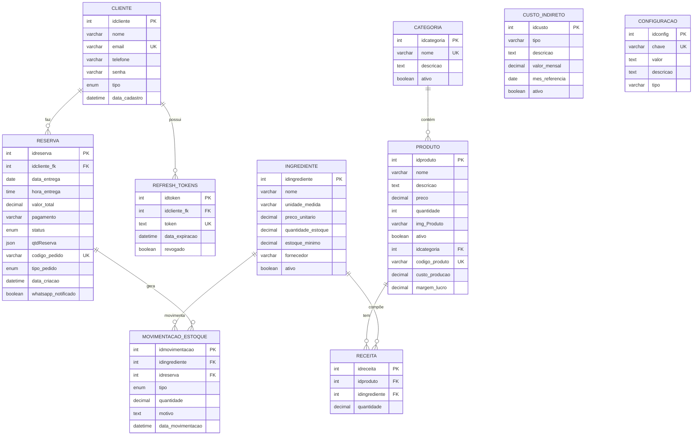

# 📊 ATIVIDADE #15 - MODELO DE DADOS E DICIONÁRIO DE DADOS
## Sistema Segredo do Sabor - DoceGest MVP v4.0

**Disciplina**: Desenvolvimento de Sistemas  
**Data**: 13 de Outubro de 2025  
**Banco de Dados**: MySQL 8.0+ (Relacional)

---

## 📋 Índice

1. [Informações do Banco de Dados](#1-informações-do-banco-de-dados)
2. [Modelo Entidade-Relacionamento (MER)](#2-modelo-entidade-relacionamento-mer)
3. [Dicionário de Dados Completo](#3-dicionário-de-dados-completo)
4. [Views e Procedures](#4-views-e-procedures)

---

## 1. 📊 Informações do Banco de Dados

### 1.1 Banco de Dados Escolhido

**Sistema Gerenciador**: MySQL  
**Versão**: 8.0.35  
**Tipo**: Banco de Dados Relacional (RDBMS)  
**Engine**: InnoDB  
**Charset**: UTF8MB4 (suporte completo a Unicode e emojis)  
**Collation**: utf8mb4_general_ci

### 1.2 Justificativa da Escolha

O **MySQL** foi escolhido pelos seguintes motivos:

1. **Confiabilidade**: SGBD maduro e estável, usado por grandes empresas
2. **ACID Compliance**: Garante transações seguras (Atomicidade, Consistência, Isolamento, Durabilidade)
3. **Performance**: Excelente desempenho para aplicações web
4. **Gratuito**: Open-source e sem custos de licença
5. **Comunidade**: Grande comunidade e documentação abundante
6. **Integração**: Ótima integração com Node.js via mysql2
7. **Ferramentas**: MySQL Workbench para modelagem visual
8. **Hospedagem**: Facilmente disponível em provedores cloud (AWS RDS, ClearDB, etc)

### 1.3 Características do Banco

- **10 Tabelas Principais**: Armazenamento de dados do sistema
- **6 Views**: Consultas otimizadas para relatórios
- **5 Stored Procedures**: Lógica de negócio no banco
- **5 Triggers**: Automações e cálculos automáticos
- **Foreign Keys**: Integridade referencial entre tabelas
- **Índices**: Otimização de performance em consultas
- **Transações**: Operações ACID para garantir consistência

---

## 2. 🗺️ Modelo Entidade-Relacionamento (MER)

### 2.1 Diagrama ER Completo



### 2.2 Relacionamentos Detalhados

| Entidade Origem | Cardinalidade | Entidade Destino | Descrição |
|----------------|---------------|------------------|-----------|
| **CLIENTE** | 1:N | **RESERVA** | Um cliente pode fazer vários pedidos |
| **CLIENTE** | 1:N | **REFRESH_TOKENS** | Um cliente pode ter vários tokens ativos |
| **CATEGORIA** | 1:N | **PRODUTO** | Uma categoria contém vários produtos |
| **PRODUTO** | 1:N | **RECEITA** | Um produto tem vários ingredientes em sua receita |
| **INGREDIENTE** | 1:N | **RECEITA** | Um ingrediente está presente em várias receitas |
| **INGREDIENTE** | 1:N | **MOVIMENTACAO_ESTOQUE** | Um ingrediente tem várias movimentações |
| **RESERVA** | 1:N | **MOVIMENTACAO_ESTOQUE** | Um pedido gera várias movimentações de estoque |

### 2.3 Dependências e Chaves

**Chaves Primárias (PK)**:
- Identificador único de cada registro
- Auto-incremento (INT)
- Nunca podem ser NULL

**Chaves Estrangeiras (FK)**:
- Referenciam chaves primárias de outras tabelas
- Garantem integridade referencial
- Configuradas com `ON DELETE RESTRICT` ou `ON UPDATE CASCADE`

**Chaves Únicas (UK)**:
- Garantem unicidade de valores
- Exemplos: email do cliente, token JWT, código do produto

---

## 3. 📖 Dicionário de Dados Completo

### 3.1 Entidade: CLIENTE

**Descrição**: Armazena informações de usuários do sistema (clientes e administradores)

| Atributo | Tipo de Dado | Obrigatório | Descrição | Observação |
|----------|--------------|-------------|-----------|------------|
| **idcliente** | INT | Sim | Identificador único do cliente | PK, AUTO_INCREMENT |
| **nome** | VARCHAR(100) | Sim | Nome completo do cliente | Ex: "João Silva" |
| **email** | VARCHAR(100) | Sim | Email do cliente (login) | UNIQUE, Ex: "joao@email.com" |
| **telefone** | VARCHAR(20) | Não | Telefone com DDD | Ex: "(11) 98765-4321" |
| **senha** | VARCHAR(255) | Sim | Hash da senha (bcrypt) | Ex: "$2b$10$..." |
| **tipo** | ENUM | Sim | Tipo de usuário | Valores: 'cliente', 'admin' |
| **data_cadastro** | DATETIME | Sim | Data/hora do cadastro | DEFAULT CURRENT_TIMESTAMP |

**Índices**:
- PRIMARY KEY: `idcliente`
- UNIQUE KEY: `email`

**Constraints**:
- Email deve ser único no sistema
- Senha armazenada com hash bcrypt (10 rounds)
- Tipo padrão: 'cliente'

---

### 3.2 Entidade: REFRESH_TOKENS

**Descrição**: Armazena tokens JWT de refresh para renovação de autenticação

| Atributo | Tipo de Dado | Obrigatório | Descrição | Observação |
|----------|--------------|-------------|-----------|------------|
| **idtoken** | INT | Sim | Identificador único do token | PK, AUTO_INCREMENT |
| **idcliente_fk** | INT | Sim | Referência ao cliente | FK → cliente(idcliente) |
| **token** | TEXT | Sim | Token JWT de refresh | UNIQUE |
| **data_expiracao** | DATETIME | Sim | Data de expiração do token | Ex: +7 dias |
| **revogado** | BOOLEAN | Sim | Token foi revogado? | DEFAULT FALSE |

**Índices**:
- PRIMARY KEY: `idtoken`
- FOREIGN KEY: `idcliente_fk` → `cliente(idcliente)`
- UNIQUE KEY: `token`

**Constraints**:
- Token expira em 7 dias
- Token revogado não pode ser usado
- Ao deletar cliente, deletar seus tokens

---

### 3.3 Entidade: CATEGORIA

**Descrição**: Categorias de produtos (ex: Cones, Bolos, Doces)

| Atributo | Tipo de Dado | Obrigatório | Descrição | Observação |
|----------|--------------|-------------|-----------|------------|
| **idcategoria** | INT | Sim | Identificador único da categoria | PK, AUTO_INCREMENT |
| **nome** | VARCHAR(100) | Sim | Nome da categoria | UNIQUE, Ex: "Cones Recheados" |
| **descricao** | TEXT | Não | Descrição da categoria | Ex: "Cones artesanais..." |
| **ativo** | BOOLEAN | Sim | Categoria está ativa? | DEFAULT TRUE |

**Índices**:
- PRIMARY KEY: `idcategoria`
- UNIQUE KEY: `nome`

**Constraints**:
- Nome deve ser único
- Categorias podem ser desativadas sem deletar

---

### 3.4 Entidade: PRODUTO

**Descrição**: Produtos do catálogo (itens à venda)

| Atributo | Tipo de Dado | Obrigatório | Descrição | Observação |
|----------|--------------|-------------|-----------|------------|
| **idproduto** | INT | Sim | Identificador único do produto | PK, AUTO_INCREMENT |
| **nome** | VARCHAR(100) | Sim | Nome do produto | Ex: "Cone Ovomaltine" |
| **descricao** | TEXT | Não | Descrição detalhada | Ex: "Cone recheado com..." |
| **preco** | DECIMAL(10,2) | Sim | Preço de venda | Ex: 12.50 |
| **quantidade** | INT | Sim | Quantidade em estoque | DEFAULT 0 |
| **img_Produto** | VARCHAR(255) | Não | Caminho da imagem | Ex: "storage/abc123.jpg" |
| **ativo** | BOOLEAN | Sim | Produto está ativo? | DEFAULT TRUE |
| **idcategoria** | INT | Sim | Referência à categoria | FK → categoria(idcategoria) |
| **codigo_produto** | VARCHAR(50) | Não | Código único do produto | UNIQUE, Ex: "CONE-OVO-001" |
| **custo_producao** | DECIMAL(10,2) | Não | Custo total de produção | Calculado por trigger |
| **margem_lucro** | DECIMAL(5,2) | Não | Margem de lucro (%) | Ex: 45.00 (45%) |

**Índices**:
- PRIMARY KEY: `idproduto`
- FOREIGN KEY: `idcategoria` → `categoria(idcategoria)`
- UNIQUE KEY: `codigo_produto`
- INDEX: `ativo`, `idcategoria`

**Constraints**:
- Preço deve ser maior que 0
- Quantidade não pode ser negativa
- Custo de produção calculado automaticamente
- Margem de lucro = ((preco - custo) / custo) * 100

---

### 3.5 Entidade: RESERVA

**Descrição**: Pedidos/reservas de clientes

| Atributo | Tipo de Dado | Obrigatório | Descrição | Observação |
|----------|--------------|-------------|-----------|------------|
| **idreserva** | INT | Sim | Identificador único da reserva | PK, AUTO_INCREMENT |
| **idcliente_fk** | INT | Sim | Referência ao cliente | FK → cliente(idcliente) |
| **data_entrega** | DATE | Sim | Data de entrega/retirada | Ex: 2025-10-20 |
| **hora_entrega** | TIME | Sim | Hora de entrega/retirada | Ex: 14:00:00 |
| **valor_total** | DECIMAL(10,2) | Sim | Valor total do pedido | Ex: 125.50 |
| **pagamento** | VARCHAR(50) | Sim | Forma de pagamento | Ex: "PIX", "Dinheiro", "Cartão" |
| **status** | ENUM | Sim | Status do pedido | Ver observação |
| **qtdReserva** | JSON | Sim | Produtos do pedido | Array de objetos JSON |
| **codigo_pedido** | VARCHAR(50) | Não | Código único do pedido | UNIQUE, gerado por trigger |
| **tipo_pedido** | ENUM | Sim | Tipo de pedido | 'RETIRADA' ou 'ENTREGA' |
| **data_criacao** | DATETIME | Sim | Data/hora da criação | DEFAULT CURRENT_TIMESTAMP |
| **whatsapp_notificado** | BOOLEAN | Sim | Cliente foi notificado? | DEFAULT FALSE |

**Valores do campo `status`**:
1. "Pendente" - Aguardando confirmação
2. "Confirmado" - Pedido confirmado
3. "Em Produção" - Sendo preparado
4. "Pronto" - Pronto para retirada/entrega
5. "Entregue" - Pedido finalizado
6. "Cancelado" - Pedido cancelado

**Estrutura do campo `qtdReserva` (JSON)**:
```json
[
  {
    "idproduto": 1,
    "nome": "Cone Ovomaltine",
    "quantidade": 2,
    "preco_unitario": 12.50,
    "subtotal": 25.00
  },
  {
    "idproduto": 3,
    "nome": "Cone Nutella",
    "quantidade": 1,
    "preco_unitario": 13.00,
    "subtotal": 13.00
  }
]
```

**Formato do `codigo_pedido`**: `PED{YYYYMMDD}{NNN}`
- Exemplo: `PED20251013001` (primeiro pedido do dia 13/10/2025)

**Índices**:
- PRIMARY KEY: `idreserva`
- FOREIGN KEY: `idcliente_fk` → `cliente(idcliente)`
- UNIQUE KEY: `codigo_pedido`
- INDEX: `status`, `data_entrega`, `data_criacao`

**Constraints**:
- Data de entrega deve ser futura
- Valor total deve ser maior que 0
- Código do pedido gerado automaticamente por trigger

---

### 3.6 Entidade: INGREDIENTE

**Descrição**: Matérias-primas usadas nas receitas

| Atributo | Tipo de Dado | Obrigatório | Descrição | Observação |
|----------|--------------|-------------|-----------|------------|
| **idingrediente** | INT | Sim | Identificador único do ingrediente | PK, AUTO_INCREMENT |
| **nome** | VARCHAR(100) | Sim | Nome do ingrediente | Ex: "Ovomaltine" |
| **unidade_medida** | VARCHAR(20) | Sim | Unidade de medida | Ex: "g", "ml", "kg", "un" |
| **preco_unitario** | DECIMAL(10,2) | Sim | Preço por unidade | Ex: 0.05 (5 centavos/g) |
| **quantidade_estoque** | DECIMAL(10,2) | Sim | Quantidade em estoque | Ex: 5000.00 (5kg) |
| **estoque_minimo** | DECIMAL(10,2) | Sim | Estoque mínimo (alerta) | Ex: 500.00 (500g) |
| **fornecedor** | VARCHAR(100) | Não | Nome do fornecedor | Ex: "Distribuidora ABC" |
| **ativo** | BOOLEAN | Sim | Ingrediente está ativo? | DEFAULT TRUE |

**Índices**:
- PRIMARY KEY: `idingrediente`
- INDEX: `ativo`, `quantidade_estoque`

**Constraints**:
- Preço unitário deve ser maior que 0
- Quantidade em estoque não pode ser negativa
- Estoque mínimo usado para alertas

---

### 3.7 Entidade: RECEITA

**Descrição**: Composição dos produtos (BOM - Bill of Materials)

| Atributo | Tipo de Dado | Obrigatório | Descrição | Observação |
|----------|--------------|-------------|-----------|------------|
| **idreceita** | INT | Sim | Identificador único da receita | PK, AUTO_INCREMENT |
| **idproduto** | INT | Sim | Referência ao produto | FK → produto(idproduto) |
| **idingrediente** | INT | Sim | Referência ao ingrediente | FK → ingrediente(idingrediente) |
| **quantidade** | DECIMAL(10,2) | Sim | Quantidade do ingrediente | Ex: 50.00 (50g) |

**Exemplo de Receita**:
```
Produto: Cone Ovomaltine (idproduto = 1)
├── Ingrediente: Casquinha (50g)
├── Ingrediente: Ovomaltine (30g)
├── Ingrediente: Leite Condensado (20ml)
└── Ingrediente: Creme de Leite (15ml)
```

**Cálculo Automático de Custo**:
```
Custo Produto = SUM(quantidade * preco_unitario) de todos ingredientes
Exemplo:
- Casquinha: 50g × R$ 0,02/g = R$ 1,00
- Ovomaltine: 30g × R$ 0,05/g = R$ 1,50
- Leite Condensado: 20ml × R$ 0,03/ml = R$ 0,60
- Creme: 15ml × R$ 0,04/ml = R$ 0,60
Total: R$ 3,70
```

**Índices**:
- PRIMARY KEY: `idreceita`
- FOREIGN KEY: `idproduto` → `produto(idproduto)`
- FOREIGN KEY: `idingrediente` → `ingrediente(idingrediente)`
- UNIQUE KEY: `(idproduto, idingrediente)` - Impede duplicação

**Constraints**:
- Quantidade deve ser maior que 0
- Não pode ter o mesmo ingrediente duas vezes no mesmo produto
- Trigger recalcula custo do produto ao inserir/alterar/deletar

---

### 3.8 Entidade: MOVIMENTACAO_ESTOQUE

**Descrição**: Histórico de movimentações de estoque de ingredientes

| Atributo | Tipo de Dado | Obrigatório | Descrição | Observação |
|----------|--------------|-------------|-----------|------------|
| **idmovimentacao** | INT | Sim | Identificador único da movimentação | PK, AUTO_INCREMENT |
| **idingrediente** | INT | Sim | Referência ao ingrediente | FK → ingrediente(idingrediente) |
| **idreserva** | INT | Não | Referência ao pedido (se saída) | FK → reserva(idreserva) |
| **tipo** | ENUM | Sim | Tipo de movimentação | 'ENTRADA' ou 'SAIDA' |
| **quantidade** | DECIMAL(10,2) | Sim | Quantidade movimentada | Ex: 500.00 |
| **motivo** | TEXT | Não | Motivo da movimentação | Ver observação |
| **data_movimentacao** | DATETIME | Sim | Data/hora da movimentação | DEFAULT CURRENT_TIMESTAMP |

**Valores do campo `tipo`**:
- **ENTRADA**: Compra de matéria-prima, devolução, ajuste positivo
- **SAIDA**: Venda (produção de pedido), perda, ajuste negativo

**Exemplos de `motivo`**:
- ENTRADA: "Compra de fornecedor", "Devolução de cliente", "Ajuste de inventário"
- SAIDA: "Baixa automática - Pedido PED20251013001", "Perda por validade", "Ajuste de inventário"

**Índices**:
- PRIMARY KEY: `idmovimentacao`
- FOREIGN KEY: `idingrediente` → `ingrediente(idingrediente)`
- FOREIGN KEY: `idreserva` → `reserva(idreserva)`
- INDEX: `tipo`, `data_movimentacao`

**Constraints**:
- Quantidade deve ser maior que 0
- Saídas vinculadas a pedidos têm idreserva preenchido
- Histórico nunca é deletado (auditoria)

---

### 3.9 Entidade: CUSTO_INDIRETO

**Descrição**: Custos fixos mensais da confeitaria (aluguel, luz, água, etc)

| Atributo | Tipo de Dado | Obrigatório | Descrição | Observação |
|----------|--------------|-------------|-----------|------------|
| **idcusto** | INT | Sim | Identificador único do custo | PK, AUTO_INCREMENT |
| **tipo** | VARCHAR(100) | Sim | Tipo do custo | Ex: "Aluguel", "Energia", "Água" |
| **descricao** | TEXT | Não | Descrição detalhada | Ex: "Conta de luz do mês" |
| **valor_mensal** | DECIMAL(10,2) | Sim | Valor do custo no mês | Ex: 500.00 |
| **mes_referencia** | DATE | Sim | Mês de referência | Ex: 2025-10-01 |
| **ativo** | BOOLEAN | Sim | Custo está ativo? | DEFAULT TRUE |

**Exemplos de Custos Indiretos**:
```
Tipo: "Aluguel"
Valor: R$ 1.500,00
Mês: 2025-10-01

Tipo: "Energia Elétrica"
Valor: R$ 350,00
Mês: 2025-10-01

Tipo: "Água"
Valor: R$ 80,00
Mês: 2025-10-01

Tipo: "Internet"
Valor: R$ 100,00
Mês: 2025-10-01
```

**Índices**:
- PRIMARY KEY: `idcusto`
- INDEX: `mes_referencia`, `ativo`

**Constraints**:
- Valor mensal deve ser maior que 0
- Mês de referência sempre primeiro dia do mês

---

### 3.10 Entidade: CONFIGURACAO

**Descrição**: Configurações gerais do sistema (parâmetros)

| Atributo | Tipo de Dado | Obrigatório | Descrição | Observação |
|----------|--------------|-------------|-----------|------------|
| **idconfig** | INT | Sim | Identificador único da config | PK, AUTO_INCREMENT |
| **chave** | VARCHAR(100) | Sim | Chave da configuração | UNIQUE, Ex: "taxa_entrega" |
| **valor** | TEXT | Sim | Valor da configuração | Ex: "10.00" |
| **descricao** | TEXT | Não | Descrição da configuração | Ex: "Taxa de entrega em R$" |
| **tipo** | VARCHAR(50) | Sim | Tipo do valor | 'decimal', 'string', 'boolean', 'json' |

**Exemplos de Configurações**:
```sql
chave: "taxa_entrega"
valor: "10.00"
tipo: "decimal"
descricao: "Taxa fixa de entrega em reais"

chave: "horario_funcionamento"
valor: '{"abertura": "08:00", "fechamento": "18:00"}'
tipo: "json"
descricao: "Horário de funcionamento"

chave: "pedido_minimo"
valor: "30.00"
tipo: "decimal"
descricao: "Valor mínimo para pedidos"

chave: "whatsapp_ativo"
valor: "true"
tipo: "boolean"
descricao: "Notificações WhatsApp ativadas"
```

**Índices**:
- PRIMARY KEY: `idconfig`
- UNIQUE KEY: `chave`

**Constraints**:
- Chave deve ser única
- Tipo define como interpretar o valor

---

## 4. 📊 Views e Procedures

### 4.1 View: vw_custo_produtos

**Descrição**: Análise de custos e margens de lucro dos produtos

| Campo | Tipo de Dado | Obrigatório | Descrição | Exemplo |
|-------|--------------|-------------|-----------|---------|
| **idproduto** | INT | Sim | ID do produto | 1 |
| **nome_produto** | VARCHAR(100) | Sim | Nome do produto | "Cone Ovomaltine" |
| **categoria** | VARCHAR(100) | Sim | Nome da categoria | "Cones" |
| **preco_venda** | DECIMAL(10,2) | Sim | Preço de venda | 12.50 |
| **custo_producao** | DECIMAL(10,2) | Sim | Custo calculado | 3.70 |
| **margem_lucro** | DECIMAL(10,2) | Sim | Margem de lucro (%) | 237.84 |
| **lucro_unitario** | DECIMAL(10,2) | Sim | Lucro por unidade | 8.80 |
| **quantidade_estoque** | INT | Sim | Estoque atual | 15 |

**Query da View**:
```sql
CREATE VIEW vw_custo_produtos AS
SELECT 
    p.idproduto,
    p.nome AS nome_produto,
    c.nome AS categoria,
    p.preco AS preco_venda,
    p.custo_producao,
    ROUND(((p.preco - p.custo_producao) / p.custo_producao * 100), 2) AS margem_lucro,
    ROUND(p.preco - p.custo_producao, 2) AS lucro_unitario,
    p.quantidade AS quantidade_estoque
FROM produto p
LEFT JOIN categoria c ON p.idcategoria = c.idcategoria
WHERE p.ativo = 1;
```

---

### 4.2 View: vw_produtos_estoque_baixo

**Descrição**: Produtos com estoque crítico (abaixo do mínimo)

| Campo | Tipo de Dado | Obrigatório | Descrição | Exemplo |
|-------|--------------|-------------|-----------|---------|
| **idproduto** | INT | Sim | ID do produto | 3 |
| **nome** | VARCHAR(100) | Sim | Nome do produto | "Cone Nutella" |
| **quantidade_atual** | INT | Sim | Estoque atual | 2 |
| **status** | VARCHAR(20) | Sim | Status do estoque | "CRÍTICO" ou "BAIXO" |

**Critérios**:
- **CRÍTICO**: Estoque = 0
- **BAIXO**: Estoque entre 1 e 5 unidades

---

### 4.3 View: vw_ingredientes_estoque_baixo

**Descrição**: Ingredientes que precisam ser comprados (lista de compras)

| Campo | Tipo de Dado | Obrigatório | Descrição | Exemplo |
|-------|--------------|-------------|-----------|---------|
| **idingrediente** | INT | Sim | ID do ingrediente | 5 |
| **nome** | VARCHAR(100) | Sim | Nome do ingrediente | "Ovomaltine" |
| **quantidade_atual** | DECIMAL(10,2) | Sim | Estoque atual | 250.00 |
| **estoque_minimo** | DECIMAL(10,2) | Sim | Estoque mínimo | 500.00 |
| **unidade_medida** | VARCHAR(20) | Sim | Unidade | "g" |
| **quantidade_comprar** | DECIMAL(10,2) | Sim | Sugestão de compra | 250.00 |

**Cálculo de `quantidade_comprar`**:
```
quantidade_comprar = estoque_minimo - quantidade_atual
```

---

### 4.4 View: vw_vendas_hoje

**Descrição**: Dashboard de vendas do dia atual

| Campo | Tipo de Dado | Obrigatório | Descrição | Exemplo |
|-------|--------------|-------------|-----------|---------|
| **total_pedidos** | INT | Sim | Total de pedidos hoje | 15 |
| **valor_total** | DECIMAL(10,2) | Sim | Faturamento do dia | 450.00 |
| **ticket_medio** | DECIMAL(10,2) | Sim | Valor médio por pedido | 30.00 |
| **pedidos_pendentes** | INT | Sim | Pedidos aguardando | 3 |

---

### 4.5 View: vw_vendas_mes_atual

**Descrição**: Vendas diárias do mês atual

| Campo | Tipo de Dado | Obrigatório | Descrição | Exemplo |
|-------|--------------|-------------|-----------|---------|
| **data** | DATE | Sim | Data da venda | 2025-10-13 |
| **total_pedidos** | INT | Sim | Pedidos do dia | 8 |
| **valor_total** | DECIMAL(10,2) | Sim | Faturamento do dia | 240.00 |

---

### 4.6 View: vw_produtos_mais_vendidos

**Descrição**: Ranking dos produtos mais vendidos

| Campo | Tipo de Dado | Obrigatório | Descrição | Exemplo |
|-------|--------------|-------------|-----------|---------|
| **idproduto** | INT | Sim | ID do produto | 1 |
| **nome** | VARCHAR(100) | Sim | Nome do produto | "Cone Ovomaltine" |
| **total_vendido** | INT | Sim | Quantidade vendida | 45 |
| **receita_total** | DECIMAL(10,2) | Sim | Faturamento do produto | 562.50 |

---

### 4.7 Stored Procedure: sp_calcular_custo_produto

**Descrição**: Calcula o custo de produção de um produto baseado em sua receita

**Parâmetros**:
- `IN p_idproduto INT` - ID do produto a calcular

**Lógica**:
```sql
1. Buscar todos ingredientes da receita do produto
2. Para cada ingrediente:
   - Multiplicar quantidade × preco_unitario
3. Somar todos os custos
4. Atualizar campo custo_producao do produto
```

**Exemplo de Uso**:
```sql
CALL sp_calcular_custo_produto(1);
-- Recalcula custo do produto ID 1
```

---

### 4.8 Stored Procedure: sp_recalcular_todos_custos

**Descrição**: Recalcula custos de todos os produtos ativos

**Parâmetros**: Nenhum

**Lógica**:
```sql
1. Buscar todos produtos ativos
2. Para cada produto:
   - Chamar sp_calcular_custo_produto(idproduto)
```

**Exemplo de Uso**:
```sql
CALL sp_recalcular_todos_custos();
-- Recalcula todos produtos
```

---

### 4.9 Stored Procedure: sp_baixar_estoque_venda

**Descrição**: Baixa estoque de ingredientes após confirmação de pedido

**Parâmetros**:
- `IN p_idreserva INT` - ID do pedido

**Lógica**:
```sql
1. Buscar produtos do pedido (campo qtdReserva JSON)
2. Para cada produto:
   a. Buscar receita do produto
   b. Para cada ingrediente da receita:
      - Calcular quantidade: qtd_produto × qtd_ingrediente_receita
      - INSERT em movimentacao_estoque (SAIDA)
      - UPDATE ingrediente (subtrair quantidade)
   c. UPDATE produto (subtrair quantidade vendida)
```

**Exemplo**:
```
Pedido #123: 2x Cone Ovomaltine

Receita Cone Ovomaltine:
├── Casquinha: 50g
├── Ovomaltine: 30g
├── Leite Condensado: 20ml
└── Creme: 15ml

Baixas:
├── Casquinha: 100g (2 × 50g)
├── Ovomaltine: 60g (2 × 30g)
├── Leite Condensado: 40ml (2 × 20ml)
└── Creme: 30ml (2 × 15ml)
```

**Exemplo de Uso**:
```sql
CALL sp_baixar_estoque_venda(123);
-- Baixa estoque do pedido #123
```

---

### 4.10 Stored Procedure: sp_adicionar_receita

**Descrição**: Adiciona ingrediente à receita de um produto

**Parâmetros**:
- `IN p_idproduto INT` - ID do produto
- `IN p_idingrediente INT` - ID do ingrediente
- `IN p_quantidade DECIMAL(10,2)` - Quantidade do ingrediente

**Lógica**:
```sql
1. Verificar se produto existe
2. Verificar se ingrediente existe
3. INSERT INTO receita
4. Chamar sp_calcular_custo_produto(p_idproduto)
```

---

### 4.11 Stored Procedure: sp_gerar_codigo_pedido

**Descrição**: Gera código único para pedido (usado por trigger)

**Parâmetros**: Nenhum (usa data atual)

**Formato**: `PED{YYYYMMDD}{NNN}`

**Lógica**:
```sql
1. Obter data atual (YYYYMMDD)
2. Contar pedidos do dia
3. Incrementar contador
4. Formatar: PED + data + contador (3 dígitos)
```

**Exemplo**:
```
Data: 13/10/2025
Pedidos do dia: 5

Próximo código: PED20251013006
```

---

### 4.12 Trigger: tr_receita_after_insert

**Descrição**: Recalcula custo do produto ao adicionar ingrediente à receita

**Evento**: AFTER INSERT ON receita

**Ação**:
```sql
CALL sp_calcular_custo_produto(NEW.idproduto);
```

---

### 4.13 Trigger: tr_receita_after_update

**Descrição**: Recalcula custo do produto ao alterar quantidade de ingrediente

**Evento**: AFTER UPDATE ON receita

**Ação**:
```sql
CALL sp_calcular_custo_produto(NEW.idproduto);
```

---

### 4.14 Trigger: tr_receita_after_delete

**Descrição**: Recalcula custo do produto ao remover ingrediente da receita

**Evento**: AFTER DELETE ON receita

**Ação**:
```sql
CALL sp_calcular_custo_produto(OLD.idproduto);
```

---

### 4.15 Trigger: tr_ingrediente_after_update

**Descrição**: Recalcula custos de todos produtos ao alterar preço de ingrediente

**Evento**: AFTER UPDATE ON ingrediente

**Condição**: Se preço_unitario foi alterado

**Ação**:
```sql
IF NEW.preco_unitario != OLD.preco_unitario THEN
    CALL sp_recalcular_todos_custos();
END IF;
```

---

### 4.16 Trigger: tr_reserva_before_insert

**Descrição**: Gera código único do pedido antes de inserir

**Evento**: BEFORE INSERT ON reserva

**Ação**:
```sql
SET NEW.codigo_pedido = sp_gerar_codigo_pedido();
```

---

## 📈 Estatísticas do Banco de Dados

### Resumo Quantitativo

| Item | Quantidade |
|------|------------|
| **Tabelas** | 10 |
| **Views** | 6 |
| **Stored Procedures** | 5 |
| **Triggers** | 5 |
| **Relacionamentos (FK)** | 8 |
| **Índices** | 25+ |
| **Constraints** | 30+ |

### Tamanho Estimado dos Dados

**Estimativa para 1 ano de operação**:

| Tabela | Registros Estimados | Tamanho Aproximado |
|--------|--------------------|--------------------|
| cliente | 500 | 50 KB |
| refresh_tokens | 1.000 | 200 KB |
| categoria | 10 | 1 KB |
| produto | 50 | 10 KB |
| reserva | 5.000 | 2 MB |
| ingrediente | 100 | 20 KB |
| receita | 200 | 10 KB |
| movimentacao_estoque | 20.000 | 5 MB |
| custo_indireto | 120 | 5 KB |
| configuracao | 20 | 2 KB |
| **TOTAL** | **~27.000** | **~7.5 MB** |

---

## ✅ Validação e Integridade

### Regras de Integridade Implementadas

1. **Integridade de Entidade**: Todas as tabelas têm chave primária
2. **Integridade Referencial**: Foreign keys com ON DELETE RESTRICT
3. **Integridade de Domínio**: CHECK constraints e ENUMs
4. **Integridade Semântica**: Triggers para cálculos automáticos

### Validações de Negócio

- ✅ Email único por cliente
- ✅ Preços sempre positivos
- ✅ Estoque não pode ser negativo
- ✅ Data de entrega deve ser futura
- ✅ Código de pedido único
- ✅ Custos recalculados automaticamente
- ✅ Histórico de movimentações preservado

---

## 🎯 Conclusão

O modelo de dados do **Sistema Segredo do Sabor** foi projetado seguindo as melhores práticas de modelagem relacional:

✅ **Normalização**: Banco normalizado (3FN) evitando redundâncias  
✅ **Integridade**: Foreign Keys garantem consistência  
✅ **Performance**: Índices otimizam consultas frequentes  
✅ **Automação**: Triggers calculam custos automaticamente  
✅ **Auditoria**: Histórico completo de movimentações  
✅ **Escalabilidade**: Estrutura pronta para crescimento  
✅ **Segurança**: Senhas hashadas, tokens revogáveis  
✅ **Flexibilidade**: JSON para dados dinâmicos (pedidos)

O banco de dados está **pronto para produção** e suporta todas as funcionalidades do MVP, com possibilidade de expansão futura sem quebrar a estrutura existente.

---

**Documentação Completa**: 13 de Outubro de 2025  
**Versão**: 4.0 - DoceGest MVP  
**SGBD**: MySQL 8.0.35  
**Engine**: InnoDB  
**Charset**: UTF8MB4
